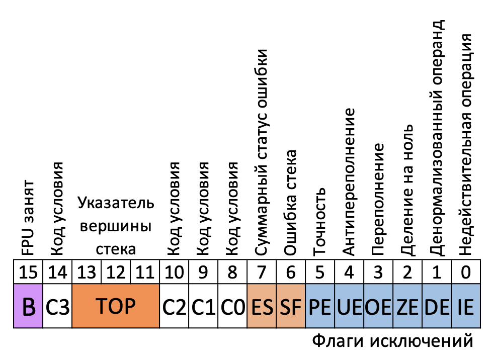

# 26.04.23 / Продолжение работы с числами с плавающей точкой (x87)

## Задача №1
Даны два вектора в пространстве $\R^{n}$: $\vec{x}$ и $\vec{y}$. Найти их скалярное произведение: $(\vec{x}, \vec{y}) = x_{1}y_{1} + x_{2}y_{2} + ... + x_{n}y_{n}$.

Прототип функции:
```c
double scalar(int n, double *x, double *y);
```

### Решение
```nasm
scalar:
    push EBP
    mov EBP, ESP
    push EDI
    finit
    mov EAX, dword[EBP + 8]     ; n
    mov ECX, dword[EBP + 12]    ; *x
    mov EDX, dword[EBP + 16]    ; *y
    fldz                        ; Результат = +0
    xor EDI, EDI
.loop:
    cmp EDI, EAX
    jae .end
    fld qword[ECX + EDI * 4]    ; x[i]
    fld qword[EDX + EDI * 4]    ; y[i]
    fmulp                       ; ST1 = x[i] * y[i]; pop()
    faddp                       ; ST1 += ST0; pop()
    inc EDI
    jmp .loop
.end:
    pop EDI
    leave
    ret                         ; Результат находится в ST0
```

## Задача №2
Написать функцию, в которой считываются из бинарного файла  вещественные числа (`double`) и вычисляется их среднее.

Прототип функции:
```c
double avg(FILE *f);
```

### Решение

```nasm
avg:
    push EBP
    mov EBP, ESP
    and ESP, ~15    ; Выравниваем стек 
    push EDI        ; 4 байта на EDI
    sub ESP, 28     ; 28 байт на аргументы и автоматические переменные
                    ; 4 + 28 = 32 байт - кратно 16 => Выровнили 
    finit
    fldz
    xor EDI, EDI
.loop:
    mov EAX, dword[EBP + 8]
    mov dword[ESP + 12], EAX
    mov dword[ESP + 8], 1
    mov dword[ESP + 4], 8
    lea EAX, [ESP + 16]
    mov dword[ESP], EAX
    call fread
    cmp EAX, 1
    jne .end
    fld qword[ESP + 16]
    faddp
    inc EDI
    jmp .loop
.end:
    fild EDI
    fdivp
    add ESP, 28
    pop EDI
    leave
    ret
```

## Сравнение вещественных чисел 
Здесь все достаточно печально. Или нет?

### Регистр состояния SW
Регистр состояния FPU выполняет почти те же функции, что и EFLAGS. 



- B - бит занятости. Для совместимости с 8087 и Intel287. Равен 0, если сопроцессор свободен, и 1, в случае занятости или прерывания в результате недействительной операции.
- TOP - вершина стека (R0 - 000, R1 - 001, ..., R7 - 111)
- C0, C1, C2, C3 - коды условий, аналогичные флагам CPU из регистра EFLAGS: 

<table>
    <thead>
        <tr>
            <th>Бит из SW</th>
            <td>С0</td>
            <td>С1</td>
            <td>С2</td>
            <td>С3</td>
        </tr>
    </thead>
    <tbody>
        <tr>
            <th>Бит из EFLAGS</th>
            <td>CF</td>
            <td>Нет</td>
            <td>PF</td>
            <td>ZF</td>
        </tr>
    </tbody>
</table>

Устанавливаются по результатам арифметических операций.

### Значения `EFLAGS` и соответствующие им условные переходы

<table>
    <thead>
        <tr>
            <th>Сравнение</th>
            <th>ZF (С3)</th>
            <th>PF (С2)</th>
            <th>CF (С0)</th>
            <th>Условный переход</th>
        </tr>
    </thead>
    <tbody>
        <tr>
            <th>ST0 > ST1</th>
            <td>0</td>
            <td>0</td>
            <td>0</td>
            <td>JA</td>
        </tr>
        <tr>
            <th>ST0 < ST1</th>
            <td>0</td>
            <td>0</td>
            <td>1</td>
            <td>JB</td>
        </tr>
        <tr>
            <th>ST0 == ST1</th>
            <td>1</td>
            <td>0</td>
            <td>0</td>
            <td>JE</td>
        </tr>
        <tr>
            <th>ST0 >= ST1</th>
            <td>1/0</td>
            <td>0</td>
            <td>0</td>
            <td>JAE</td>
        </tr>
        <tr>
            <th>ST0 <= ST1</th>
            <td>1/0</td>
            <td>0</td>
            <td>1/0</td>
            <td>JBE</td>
        </tr>
        <tr>
            <th>Несравнимы (например, +inf ? +inf)</th>
            <td>0</td>
            <td>1</td>
            <td>0</td>
            <td>JP</td>
        </tr>
    </tbody>
</table>

## Команды сравнения, которые НЕ СТОИТ использовать
### FCOM[P[P]] (Float COMpare [Pop [Pop]])
Проводит сравнение вершины стека с операндом-источником, который может быть регистром или операндом в памяти.

#### :bangbang: Важно
- По результатам сравнения устанавливаются биты условий C0, C2, C3 регистра SW. При этом соответствующие им биты EFLAGS НЕ ИЗМЕНЯЮТСЯ! Используйте для этого команды FCOMI (об этом в следующем разделе). 

Ниже в таблице приведены все возможные вариации данной команды.
<table>
    <thead>
        <tr>
            <th>Команда</th>
            <th>Что сравнивается</th>
            <th>Изменения в стеке</th>
            <th>Пример</th>
        </tr>
    </thead>
    <tbody>
        <tr>
            <th>FCOM m32/64</th>
            <td>ST0 и m32/64</td>
            <td>-</td>
            <td>FCOM dword[ptr_32real]</td>
        </tr>
        <tr>
            <th>FCOM STi</th>
            <td>ST0 и STi</td>
            <td>-</td>
            <td>FCOM ST3</td>
        </tr>
        <tr>
            <th>FCOM</th>
            <td>ST0 и ST1</td>
            <td>-</td>
            <td>FCOM</td>
        </tr>
        <tr>
            <th>FCOMP m32/64</th>
            <td>ST0 и m32/64</td>
            <td>ST0 выталкивается из стека</td>
            <td>FCOMP qword[ptr_64real]</td>
        </tr>
        <tr>
            <th>FCOMP STi</th>
            <td>ST0 и STi</td>
            <td>ST0 выталкивается из стека</td>
            <td>FCOMP ST3</td>
        </tr>
        <tr>
            <th>FCOMP</th>
            <td>ST0 и ST1</td>
            <td>ST0 выталкивается из стека</td>
            <td>FCOMP</td>
        </tr>
        <tr>
            <th>FCOMPP</th>
            <td>ST0 и ST1</td>
            <td>ST0 и ST1 выталкиваются из стека</td>
            <td>FCOMPP</td>
        </tr>
    </tbody>
</table>

### FUCOM[P[P]] (Float Unordered COMpare [Pop [Pop]])
Проводит сравнение вершины стека с операндом-источником, который может быть регистром.

Отличия между командами FCOM, FCOMP, FCOMPP и командами неупорядоченного сравнения FUCOM, FUCOMP, FUCOMPP заключаются в работе с операндами QNaN. FCOM, FCOMP и FCOMPP генерируют исключение #IA и устанавливают флаги в значение "несравнимо" (C0=1, C2=1, C3 = 1), если любой операнд команды NaN (SNaN или QNaN) или представлен в неподдерживаемом формате. Команды FUCOM, FUCOMP и FUCOMPP делают то же самое, кроме генерации исключения #IA для случая с операндами QNaN.

#### :bangbang: Важно
- По результатам сравнения устанавливаются биты условий C0, C2, C3 регистра SW. При этом соответствующие им биты EFLAGS НЕ ИЗМЕНЯЮТСЯ! Используйте для этого команды FCOMI (об этом в следующем разделе). 

Ниже в таблице приведены все возможные вариации данной команды.
<table>
    <thead>
        <tr>
            <th>Команда</th>
            <th>Что сравнивается</th>
            <th>Изменения в стеке</th>
            <th>Пример</th>
        </tr>
    </thead>
    <tbody>
        <tr>
            <th>FUCOM STi</th>
            <td>ST0 и STi</td>
            <td>-</td>
            <td>FUCOM ST3</td>
        </tr>
        <tr>
            <th>FUCOM</th>
            <td>ST0 и ST1</td>
            <td>-</td>
            <td>FUCOM</td>
        </tr>
        <tr>
            <th>FUCOMP STi</th>
            <td>ST0 и STi</td>
            <td>ST0 выталкивается из стека</td>
            <td>FUCOMP ST3</td>
        </tr>
        <tr>
            <th>FUCOMP</th>
            <td>ST0 и ST1</td>
            <td>ST0 выталкивается из стека</td>
            <td>FUCOMP</td>
        </tr>
        <tr>
            <th>FUCOMPP</th>
            <td>ST0 и ST1</td>
            <td>ST0 и ST1 выталкиваются из стека</td>
            <td>FUCOMPP</td>
        </tr>
    </tbody>
</table>

## Команды сравнения, которые НАДО использовать
### F[U]COMI[P] (Float [Unordered] COMpare I [Pop])
Проводит сравнение вершины стека с операндом-источником, который может быть регистром или операндом в памяти.

Отличия между командами FCOMI, FCOMIP и командами неупорядоченного сравнения FUCOMI, FUCOMIP заключаются в работе с операндами QNaN. FCOMI и FCOMIP генерируют исключение #IA и устанавливают флаги в значение "несравнимо" (ZF = 1, PF = 1, CF = 1), если любой операнд команды NaN (SNaN или QNaN) или представлен в неподдерживаемом формате. Команды FUCOMI и FUCOMIP делают то же самое, кроме генерации исключения #IA для случая с операндами QNaN.

#### :bangbang: Важно
- По результатам сравнения устанавливаются биты условий C0, C2, C3 регистра EFLAGS, а не SW! В этом и заключена прелесть этих команд!
- В этих командах НЕЛЬЗЯ выталкивать два операнда из стека сразу! Используйте связку FUCOMIP + FSTP ST0

Ниже в таблице приведены все возможные вариации данной команды.
<table>
    <thead>
        <tr>
            <th>Команда</th>
            <th>Что сравнивается</th>
            <th>Изменения в стеке</th>
            <th>Пример</th>
        </tr>
    </thead>
    <tbody>
        <tr>
            <th>FCOMI STi</th>
            <td>ST0 и STi</td>
            <td>-</td>
            <td>FCOMI ST3</td>
        </tr>
        <tr>
            <th>FCOMI</th>
            <td>ST0 и ST1</td>
            <td>-</td>
            <td>FCOMI</td>
        </tr>
        <tr>
            <th>FCOMIP STi</th>
            <td>ST0 и STi</td>
            <td>ST0 выталкивается из стека</td>
            <td>FCOMIP ST3</td>
        </tr>
        <tr>
            <th>FCOMIP</th>
            <td>ST0 и ST1</td>
            <td>ST0 выталкивается из стека</td>
            <td>FCOMIP</td>
        </tr>
        <tr>
            <th>FUCOMI STi</th>
            <td>ST0 и STi</td>
            <td>-</td>
            <td>FUCOMI ST3</td>
        </tr>
        <tr>
            <th>FUCOMI</th>
            <td>ST0 и ST1</td>
            <td>-</td>
            <td>FUCOMI</td>
        </tr>
        <tr>
            <th>FUCOMIP STi</th>
            <td>ST0 и STi</td>
            <td>ST0 выталкивается из стека</td>
            <td>FUCOMIP ST3</td>
        </tr>
        <tr>
            <th>FUCOMIP</th>
            <td>ST0 и ST1</td>
            <td>ST0 выталкивается из стека</td>
            <td>FUCOMIP</td>
        </tr>
    </tbody>
</table>


## Задача №3
Написать функцию нахождения количества корней квадратного уравнения $ax^2+bx+c=0$.

Прототип функции:
```c
int check(double a, double b, double c);
```

### Решение

```nasm
check:
    push EBP
    mov EBP, ESP
    finit
    fldz                ; Загружаем в стек 0
    fld qword[EBP + 8]  ; Загружаем в стек a
    FUCOMIP             ; Сравниваем a с нулем, вытаскиваем a из стека
    je .1
    fld qword[EBP + 16] ; Загружаем в стек b
    fld qword[EBP + 16] 
    fmulp               ; Возводим b в квадрат
    fld1
    fld1
    fadd
    fadd
    faddp
    fild qword[EBP + 8] ; Загружаем в стек a
    fild qword[EBP + 24]; Загружаем в стек c
    fmulp
    fmulp
    fsubp               ; Получили дискриминант
    fldz
    FUCOMIP             ; Сравниваем дискриминант с нулем, вытаскиваем дискриминант из стека
    ja .2
    je .1
    mov EAX 0
    jmp .end
.2:
    mov EAX, 2
    jmp .end
.1:
    mov EAX, 1
    jmp .end
.end:
    FSTP st0            ; Вытаскиваем ноль из стека
    leave
    ret
```

## Задача №4 (в качестве ДЗ)
Написать функцию возведения числа $x$ в степень $y$: $x^y$.
Подсказка: в конце есть магические функции (what?).

Прототип функции:
```c
double pow(double x, double y);
```

### Решение
Достаточно посчитать $x^y=2^{y*\log_2{x}}$. Реализовация сей "замечательного" алгоритма дается читателю в качестве упражнения.