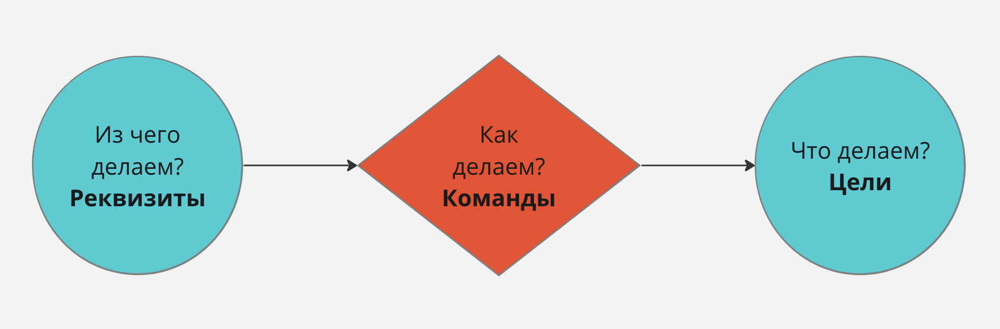
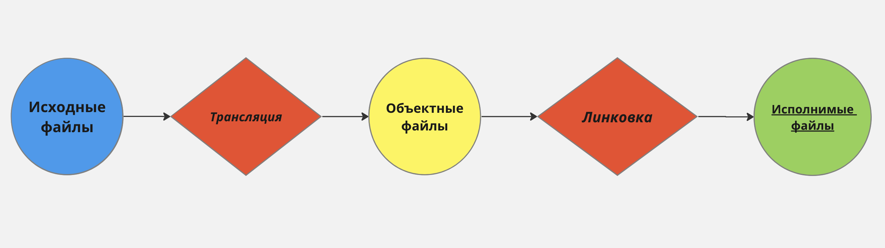

# 03.05.23 / Многомодульные C-программы. Условная компиляция. Использование библиотек. Утилита make.

## Обработка аргументов командной строки
По стандарту, функции main могут передаваться два аргумента:
- argc - количество аргументов
- argv - массив аргументов (символьных строк)
```c
int main (int argc, char *argv[]) {
    ...
    return 0;
}
```

### Пример:
```
gcc -m32 -Wall -g -W prog.c -o prog
```
- argc = 8
- argv = `["gcc", "-m32", "-Wall", "-g", "-W", "prog.c", "-o", "prog"]`

#### :bangbang: Важно
- Первый параметр - название вызванной программы.

## Многомодульные C-программы
Стандарт Си четко указывает, какие шаги нужно выполнить для компиляции программы.

### 1. Препроцессор (cpp)
Обрабатывает исходный текст программы на Си (макросы define и т.д.), после чего передает "полный" текст программы на компиляцию.

### 2. Компилятор (cc1)
Преобразует программу на языке Си в программу на языке Ассемблера.

### 3. Ассемблер (as)
Конвертирует программу на языке ассемблера для определенной архитектуры в перемещаемый объектный код.

### 4. Компоновщик (ld)
Принимает на вход один или несколько объектных модулей и собирает из них исполняемый или библиотечный файл-модуль. 

## Пример
Оба файла расположены в одной и той же рабочей директории.
### main.c
```c
int x = 2;
void printx();

int main(void) {
    x = 4;
    printx();
    return 0;
}
```
### printx.c
```c
#include <stdio.h>

// Для обозначения того, что x - символ из другого модуля,
// пишем extern
extern int x;

void printx() {
    printf("x = %d\n", x);
}
```

#### Сборка
```
gcc main.c printx.c
./a.out
>>> x = 4
```

## Связывание стандартных библиотек
Ключ `-l<lib>` утилиты `gcc` означает ссылку на библиотеку. 
К примеру, если мы хотим использовать `math.h`, то нам нужно добавить `m` - в итоге получим ключ '-lm'.

## Символы в процессе компоновки

1. Глобальные 
- Символы определенные в одном модуле таким образом, что их
можно использовать в других модулях.
- Например: не-static Си-функции и не-static глобальные
переменные.
2. Внешние
- Глобальные символы, которые используются в модуле, но
определены в каком-то другом модуле.
3. Локальные
- Символы определены и используются исключительно в одном
модуле.
- Например: Си-функции и переменные, определенные с
модификатором static.
- Локальные символы *не являются* локальными переменными Си-
программы
  
Определения функций и переменных в Си
- По умолчанию - глобальные
- С модификатором `static` - локальные
  
Определения функций и переменных в ассемблере
- По умолчанию - локальные
- С модификатором `global` - глобальные

## Макропроцессор в языке Си - include
Тупо берет и вставляет код из указанного файла в текущий файл. Таким нехитрым образом, мы сможем пользоваться его переменными, функциями, структурами.
```c
// Для заголовочных файлов, относящихся только к проекту
#include "my_header.h"

// Для библиотечных заголовочных файлов
#include <stdio.h>
#include <stdlib.h>
```

### Пример (простейший?)
#### common.h
```c
extern float x;
void printx();
```

#### printx.c
```c
#include <stdio.h>
#include "common.h"

void printx() {
    printf("x = %f\n", x);
}
```

#### main.c
```c
#include "common.h"

float x = 2;

int main(void) {
    x = 4;
    printx();
    return 0;
}
```

Флаг `-E` утилиты `gcc` остановится после препроцессинга и выведет на экран "полный" файл:
```
$ gcc -E main.c 

# 1 "main.c"
# 1 "<built-in>" 1
# 1 "<built-in>" 3
# 400 "<built-in>" 3
# 1 "<command line>" 1
# 1 "<built-in>" 2
# 1 "main.c" 2
# 1 "./common.h" 1
extern float x;
void printx();
# 2 "main.c" 2

float x = 2;

int main(void) {
    x = 4;
    printx();
    return 0;
}
```

#### :bangbang: Важно
- Если бы файл `common.h` был размещен в папке `include` внутри рабочей директории, то следует указать `gcc` при помощи флага `-I`, что необходимо добавить `include` в список каталогов для поиска заголовочных файлов. 
```
// Без флага -I:

$ gcc -E main.c

# 1 "main.c"
# 1 "<built-in>" 1
# 1 "<built-in>" 3
# 400 "<built-in>" 3
# 1 "<command line>" 1
# 1 "<built-in>" 2
# 1 "main.c" 2
main.c:1:10: fatal error: 'common.h' file not found
#include "common.h"
         ^~~~~~~~~~


float x = 2;

int main(void) {
    x = 4;
    printx();
    return 0;
}
1 error generated.

// Возникла ошибка!
// А теперь с флагом -I:

$ gcc -E main.c -I include

# 1 "main.c"
# 1 "<built-in>" 1
# 1 "<built-in>" 3
# 400 "<built-in>" 3
# 1 "<command line>" 1
# 1 "<built-in>" 2
# 1 "main.c" 2
# 1 "./common.h" 1
extern float x;
void printx();
# 2 "main.c" 2

float x = 2;

int main(void) {
    x = 4;
    printx();
    return 0;
}
```

## define
Крайне многофункциональная вещь! Но очень опасная.

### Определение констант
```c
#define tokenName val
```
По сути, `define` просто берет и заменяет все вхождения строки `tokenName` в тексте программы на `val`.

#### :bangbang: Важно
- И ежу понятно, что не стоит в качестве `tokenName` использовать односимвольные строки (даже двух-четырехсимвольные), зарезервированные имена и ключевые слова. Есть ООООГРОООМНЫЙ риск потратить день на поиск ошибки! ~~Кроме того, другие прогеры будут косо на вас смотреть.~~
- Строка токена должна быть отделена от строки `val` хотя бы одим пробелом. А значит, в `tokenName` не будет пробелов!
  
### Пример
#### macro.c
```c
// Определили константу
#define BUFSIZE 1024

int a[BUFSIZE];
```
```
$ gcc -E macro.c

# 1 "macro.c"
# 1 "<built-in>" 1
# 1 "<built-in>" 3
# 400 "<built-in>" 3
# 1 "<command line>" 1
# 1 "<built-in>" 2
# 1 "macro.c" 2


int a[1024];
```

### HOW TO: превратить СИ в ПАСКАЛЬ(!!!)

```c
#define IF if(
#define THEN ) {
#define ELSE } else {
#define ENDIF }
```

Кто так сделает в своей программе, знайте - **я вас найду**.

### Макросы с параметрами
Тот же дефайн, только с параметрами: 
```c
#define tokenName(arg1, arg2, ... ) expr
```

Таким нехитрым образом, можно сделать "функцию" вычисления максимума:
```c
#define MAX(a, b) ((a) > (b) ? (a) : (b))
```
Внимательный читатель заметит, что здесь стоят лишние скобки. На ответ к данной загадке Жака Фреско о необходимости лишних скобок читателю дается $\varepsilon > 0$ секунд. *Ответ ниже.*

#### Прикольные примеры
```c
// Тут все очевидно
#define IS_ASCII(c) (((c) & 0x80) == 0)

// А здесь мы взяли и взломали дефайн, вложив
// внутри него многострочную функцию!
#define BN_zero_ex(a) \
    do { \
        BIGNUM *_tmp_bn = (a); \
        _tmp_bn->top = 0; \
        _tmp_bn->neg = 0; \
    } while (0)
    // без do {...} while(0) код не выполнится в исключительных случаях!

// ...

BN_zero_ex(a);
```
### Ответ на загадку о скобках
Давайте уберем эти "лишние" скобки и приведем пример, при котором прога перестанет работать так, как ожидалось.
Не забывайте: дефайн просто берет и подставляет строки!
```c
// Average скобки hater
#define MAX(a, b) a > b ? a : b

x = MAX(4, a) * 5; // сломает ваш код
// После препроцессинга эта строчка будет выглядеть так:
x = 4 > a ? 4 : a * 5;

// Упс! Все-таки скобочки оказались не лишними :(

// Average скобки enjoyer
#define MAX(a, b) ((a) > (b) ? (a) : (b))
```

Запомните! **Закрываем скобками параметры в выражении и само выражение!**

## undef
Директива `#undef` используются для снятия, ранее определенной константы или макроса, в небольшой области программы. 
```c
#undef tokenName
```

## if
Работает так же, как и обычный if.
```c
#if val
// val != 0
#elsif elseval
// elseval != 0
#else
// в противном случае
#endif
```

## ifdef/ifndef
Проверяет, был ли определен ранее указанный макрос или нет.
```c
#ifdef CAT
// CAT - определен
#else
// иначе
#endif

#ifndef CAT
// CAT - не определен
#else
// иначе
#endif
```

## Header guard
Данный механизм служит для того, чтобы избежать повторяющихся определений и, как следствие, ошибок компиляции.
```c
#ifndef MYHEADER_H
#define MYHEADER_H

int foo();

#endif /* MYHEADER_H */
```

## Утилита make
make - утилита, позволяющая определеить, какие части большой программы требуют пересборки, и вызвать необходимые для этого команды.

Зависимости между файлами и правила пересборки частей системы описываются в специальном файле - `makefile` (без расширения).

Скрипт состоит из набора **правил**, которые задают:

1. Цели (что делает данное правило)
2. Реквизиты (используется правилом для выполнения цели)
3. Команды (выполняющие преобразования)

Таким образом, 99.9% синтаксиса makefile представляется в следующем виде:

```makefile
цель: реквизиты
    команда_1
    ...
    команда_n
```

Правило make = ответы на три вопроса:

- Что делаем? - цель
- Из чего делаем? - реквизиты
- Как делаем? - команды



Внимательный читатель заметит, что эта идея идеально подходит для расписанного выше процесса сборки:



### Простейший пример
Как известно любому прогеру, helloworld идеально подойдет для любого примера:

#### main.c
```c
#include <stdio.h>

int main(void) {
    printf("Hello world!\n");
    return 0;
}
```

Для того, чтобы скомпилировать такую сложную программу, достаточно прописать одно правило в `makefile`:

#### makefile
```makefile
helloworld: main.c
    gcc main.c -o main
```

Итак, нам остается лишь запустить утилиту `make` в рабочем каталоге...

```
$ make
```

#### :bangbang: Важно
- По умолчанию `make` станет выполнять самое первое правило, если цель выполнения не была явно указана при вызове.

## Все, из чего состоит makefile

### Комментарии
Не нуждаются в комментариях.
```makefile
# I am a comment. Meow!
```
~~Попался, питонист!~~

### Явные правила (explicit rule)
Были разобраны выше. ~~Тривиальнее некуда.~~
```makefile
main.o : main.c defs.h
    cc -c main.c
```

### Фиктивные и стандартные цели
Цели, которые не соответствуют файлам и предназначены для выполнения последовательности команд, декларируются через `.PHONY`:
```makefile
.PHONY: clean

clean:
    rm *.o 
```

Вызов `make clean` заставит утилиту безусловно удалить все файлы с расширением `.o` в данном примере.
Для того, чтобы `make` не искал файлы с такими именами, их следует определить в `makefile` при помощи директивы `.PHONY`.

Обычно используются следующие стандартные цели:
- `all` — является стандартной целью по умолчанию. При вызове `make` ее можно явно не указывать.
- `clean` — очистка каталога от промежуточных файлов
- `install` — произвести установку программы
- `uninstall` — произвести удаление программы

[Более подробно про .PHONY смотри здесь (на инглише).](https://stackoverflow.com/questions/2145590/what-is-the-purpose-of-phony-in-a-makefile)

### Определения переменных
Переменные в `make` представляют собой именованные строки и определяются следующим образом:
```
# Определение переменной
<VAR_NAME> = <var_string>

# Использование значения переменной
$(<VAR_NAME>)
```

Пример:
```makefile
SRC = main.c second.c

main:
    gcc $(SRC) -o main
```

### Автоматические переменные
Для чего они нужны? Узнаешь ниже)
- `$@` - имя цели обрабатываемого правила
- `$<` - имя первого реквизита
- `$^` - список всех реквизитов

[Более подробно про автоматические переменные смотри здесь.](http://rus-linux.net/nlib.php?name=/MyLDP/algol/gnu_make/gnu_make_3-79_russian_manual.html#SEC101)

### Неявные правила (implicit rule)
Указывают `make` использовать типичный "прием" для закономерно определенных файлов. К примеру, для C-компиляции берется файл с именем, оканчивающимся на `.c`, и порождается объектный файл с расширением `.o`:
```makefile
%.o : %.c
    $(CC) -c $(CFLAGS) $(CPPFLAGS) $< -o $@
```

### Директивы
К примеру, директива `include` указывает `make` приостановить чтение текущего `makefile` и прочитать один или несколько других `makefile`, прежде чем продолжить. Директива - это строка в `makefile`, которая выглядит следующим образом:
```makefile
include a.mk b.mk c.mk
# Прочитает a.mk, b.mk, c.mk и пойдет дальше
```

