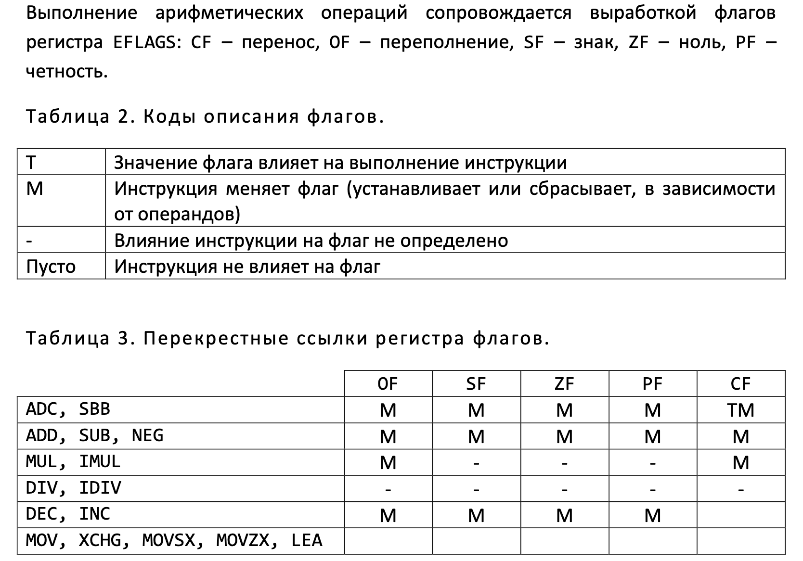

# 15.02.23 - 16.02.23 / Строение программы, операции пересылки значений и целочисленной арифметики
## Секции
### Строение программы
Как уже говорилось, файл состоит из нескольких секций, в
которых размещается код программы (последовательность ассемблерных
инструкций) и её данные.
- `.data` - секция инициализированных данных
- `.rodata` - секция данных только для чтения
- `.bss` - секция неинициализированных данных
- `.text` - секция кода

Строка с описанием данных имеет следующий вид:
`имя_переменной [:] директива_определения_данных ; комментарий`

### .data
Для определения переменных с начальными значениями используются директивы `db`, `dw`, `dd` и `dq`. Например:
`имя_переменной d<b, w, d, q> значение1[, значение2, ... ]`

Каждая директива определяет размер данных:
- `db` - byte (1 байт)
- `dw` - word (2 байт)
- `dd` - doubleword (4 байт)
- `dq` - quadword (8 байт)

#### :large_blue_diamond: Интересный факт
- Первая буква d в директивах - от слова define.

Примеры:
```nasm
section .data
    x:  db 0            ; Определение переменной x в формате слова с
                        ; начальным значением 0
    y:  db 1,2,3        ; Определение трех двойных слов с начальными
                        ; значениями 1, 2, 3
        db 1
        dw 2, 4         ; не забываем: числа хранятся в формате
                        ; little-endian!
        db 8
    z:  times 64 db 0   ; повторение команды 64 раз
```
В качестве конструкции повторения в ассемблере NASM используется префикс
`TIMES` (в отличие от `DUP` в MASMe):
`TIMES количество_раз повторяемая конструкция`

С помощью этой конструкции можно реализовывать интересные штучки:
```nasm
buffer: db ‘hello, world!’
        times 64-$+buffer db ‘ ’    ; Аргумент конструкции TIMES не 
                                    ; константа, а вычисляемое выражение
```
Начиная с метки `buffer` будет выделено 64 байта, первые байты будут заполнены заданной строкой, остальные – пробелом. Лексема `$` соответствует текущей позиции в транслируемом коде. Выражение `$-buffer`, записанное непосредственно после первой строки, будет содержать длину строки `‘hello, world!’`.

### .bss
Если начальное значение переменной не важно, ее следует располагать в секции `.bss`, все байты которой инициализируются нулем. Такая особенность позволяет экономить место в файле с исполняемым кодом: содержимое секции заранее известно, достаточно хранить только ее размер. При объявлении переменных в секции `.bss` необходимо использовать соответствующие директивы: `RESB` (byte), `RESW` (word), `RESD` (dword) и `RESQ` (qword), имеющие следующий формат.

`имя_переменной RESB количество_ячеек`

Под количеством ячеек понимается число байт, слов, двойных или четверных слов, в зависимости от использованной директивы.
```nasm
section .bss
    a resd 1    ; Выделено место для одной переменной, ее размер –
                ; двойное слово, начальные значения – 0
    b resb 20   ; Выделено место для последовательно размещенных
                ; 20 байт
    c resw 256  ; Выделено место для 256 слов
```
Имена a, b и c являются адресами, начиная с которых размещены **обнуленные** данные.

## Константы

### Как обозначать значения?
1. `0200d` - число в десятичной системе счисления (10 - `d`)
   кроме десятичной системы можно указывать: 16 - `h`, `o` (*Проверьте*!) или `q` - 8, `b` - 2
   символы - в конце
2. `0xc8` - 16-ричный формат
3. `1100_1000b` - для более удобного чтения глазами
4. `'a'` - символ (`0x61`)
5. `'abc' или "abc"` - строка
   **НЕ ЗАБУДЬТЕ ДОБАВИТЬ НУЛЬ-ТЕРМИНАТОР:** `str: db 'abc', 0`

Символьная константа содержит от одного до восьми символов, заключенных в прямые, обратные или двойные кавычки. Тип кавычек для NASM несущественен, поэтому если используются одинарные кавычки, двойные могут выступать в роли символа и, соответственно, наоборот. Обратные кавычки позволяют использовать специальные символы языка Си.
Символьная константа, состоящая из одного символа, эквивалентна целому числу, равному коду этого символа. Символьная константа, содержащая более одного символа, будет транслирована посимвольно в обратном порядке следования байтов: `'abcd'` эквивалентно не `0x61626364`, а `0x64636261`. Эта особенность обусловлена порядком хранения байтов целого числа в памяти: сначала хранятся младшие байты, за ними — старшие. Таким образом, если записать эту константу в память, а затем прочитать побайтово, получится снова abcd, но не dcba.
Строковые константы допустимы только в директивах `db/dw/dd/dq`. От символьных констант они отличаются только отсутствием ограничения на длину и интерпретируются как сцепленные друг с другом символьные константы максимального допустимого размера.

### Примеры
```nasm
dd 'ninechars' ; строковая константа – последовательность
; двойных слов
dd 'nine','char','s' ; явно заданы три двойных слова
db 'ninechars',0,0,0 ; последовательность байт
; во всех случаях указаны одни и те же данные
```

## Инструкции

### MOV (move)
```nasm
mov op1, op2
``` 
Присвоение `op1` значения `op2`.

#### :floppy_disk: Операнды
- `op1` - r/m8, r/m16, r/m32, sr
- `op2` - r/m8, r/m16, r/m32, sr, i8, i16, i32  

#### :bangbang: Перемещать значение из памяти в память процессор не умеет! 
:x: НЕЛЬЗЯ:
```nasm
mov [y], [x]
```
:white_check_mark: НАДО:
```nasm
mov EAX, [x]
mov [y], EAX
```

Примеры:
```nasm
mov byte[y], 12
mov [y], word 12 
```

```nasm
mov AL, 0
mov dword[x], EAX ; во избежание ошибок всегда пишите размер значения
```

### MOVSX (sign-extend move) и его брат MOVZX (zero-extend move)
```nasm
movsx x, y ; производит знаковое расширение
movzx x, y ; производит беззнаковое расширение
```
#### :floppy_disk: Операнды
- `op1` - r16/32
- `op2` - r8/16, m8/16

Объявление переменной в ассемблерной программе требует указания объема выделяемой памяти. Интерпретация содержимого переменной определяется исключительно кодом операции. Перевод выражений языка Си на язык ассемблера сопровождается реализацией приведений типов, которые явно или неявно присутствуют в вычислениях.
Приведение целочисленных типов языка Си можно реализовать путем расширения размера данных при пересылке значений с помощью команд `MOVZX` и `MOVSX`. При этом команда `MOVZX` выполняет беззнаковое расширение данных (число до нужного размера дополняется слева нулями), а команда `MOVSX` – знаковое расширение данных (число до нужного размера дополняется слева битами со значением знакового разряда исходного числа, т.е. нулями для неотрицательного числа и единицами для отрицательного числа).

```nasm
mov bx, 0xA67B ; bx ← 0xA67B
movzx ebx, bx ; ebx ← 0x0000A67B
movsx eax, bx ; eax ← 0xFFFFA67B
movsx ecx, bl ; ecx ← 0x0000007B
```
Подробнее - в примерах.

### XCHG (exchange)
Обменивает значения двух операндов:
```nasm
xchg x, y
```
#### :floppy_disk: Операнды
- `op1` - r8/16/32, m8/16/32
- `op2` - r8/16/32, m8/16/32

#### :bangbang: Примечание
- Оба операнда памятью быть не могут!


## Легкие и тривиальные задачи c примерами работы команд (не Зенит и Спартак)

### №1
```nasm
section .data
    a:  db 0x40
        dw 0x81
        db 0xFE
    b:  dd 0
```

```nasm
section .text
...
; а) Чему равно значение b?
mov EAX, dword[a]
mov dword[b], EAX

; Ответ: 0xFE008140 (sic!)
```

```nasm
; б) Чему равно значение b?
movsx EAX, byte[a + 3]
mov dword[b], EAX

; Ответ: 0xFFFFFFFE
```

```nasm
; в) Чему равно значение b?
movsx EAX, word[a + 1] ; знак "+", значит все тривиально
mov dword[b], EAX

; Ответ: 0x00000081
```

```nasm
; г) Чему равно значение b?
movsx EAX, byte[a + 1] ; знак "-", здесь надо заполнить единицами
mov dword[b], EAX

; Ответ: 0xFFFFFF81
```

```nasm
; д) неинтересный

; е) Чему равно значение b?
xor EAX, EAX
movsx AX, byte[a + 1] ; СТАРШИЕ БАЙТЫ EAX ОСТАЮТСЯ НУЛЕВЫМИ!
mov dword[b], EAX

; Ответ: 0x0000FF81
```
## Адресация
Так обращаются к ячейке памяти:
```nasm 
[C + R * (1/2/4/8) + R]
```
где C - константа (метка), R - регистр

### Примеры:
```nasm
[EAX * 8 + EBX]

[EAX * 5] - может посчитать: EAX * 4 + EAX
[EAX * 7] - не сможет посчитать
```
## Немного арифметики
Основные арифметические операции реализуются в языке ассемблера инструкциями `ADD`, `SUB`, `NEG`, `MUL`/`IMUL`, `DIV`/`IDIV`. Помимо того, операции уменьшения и увеличения числа на единицу поддержаны инструкциями DEC и INC.
Сложение и вычитание чисел большей длины, чем размер регистров поддержано инструкциями `ADC` и `SBB`. В определенных случаях для более быстрого вычисления арифметических выражений допустимо использовать инструкцию `LEA`.
Выполнение арифметических операций сопровождается выработкой флагов регистра `EFLAGS`: `CF` – перенос, `OF` – переполнение, `SF` – знак, `ZF` – ноль, `PF` – четность.



### LEA (load effective address)
Вычисляет эффективный адрес `op2` и помещает его в `op1`.
```nasm
LEA op1 op2
```
#### :floppy_disk: Операнды
- `op1` - r16/32
- `op2` - m16/32

Зачем она нужна?! Например, нам нужно посчитать `eax + ecx * 8 + 8`. 
Используем команду `lea ebx, [eax + ecx * 8 + 8]` вместо того, чтобы тратить лишние строки на ADD и MUL. 
В `ebx` окажется результат выражения.

### ADD (add)
Записывает в `op1` сумму `op1 + op2`
```nasm
ADD op1, op2
```
#### :floppy_disk: Операнды
- `op1` - r/m8, r/m16, r/m32
- `op2` - r/m8, r/m16, r/m32, i8, i16, i32

#### :bangbang: Примечание
- Оба операнда памятью быть не могут!

### SUB (subtract)
Записывает в `op1` разность `op1 - op2`
```nasm
SUB op1, op2
```
#### :floppy_disk: Операнды
- `op1` - r/m8, r/m16, r/m32
- `op2` - r/m8, r/m16, r/m32, i8, i16, i32

#### :bangbang: Примечание
- Оба операнда памятью быть не могут!

## Старые новые задачи
### №2 (Ассемблер.Переводчик)
```c
static int a, b;
...
a = a + b + 2;
```
Переведите *это* на язык ассемблера **без использования godbolt**.

```nasm
section .data
    a: dd 0
    b: dd 0

...

section .text
    mov EAX, dword[a]
    add EAX, dword[b]
    add EAX, 2
    mov dword[a], EAX 
```

## Инструкции негативные
### NEG (negative)
Команда NEG позволяет инвертировать знак числа `op1`. Всегда трактует значение операнда, как число со знаком.
```nasm
NEG op1
```

#### :floppy_disk: Операнды
- `op1` - r/m8, r/m16, r/m32

Команда просто берет и меняет старший бит, поэтому в случае беззнаковых чисел операнд увеличит/уменьшит значение, а не поменяет знак.

## EFLAGS
### Основы
- ZF (zero) - **Флаг нуля.** Устанавливается 1, если результат предыдущей команды равен 0.
- SF (sign) - **Флаг знака.** Этот флаг всегда равен старшему биту результата.
- PF (parity) - **Флаг чётности.** Устанавливается в 1, если младший байт результата предыдущей команды содержит чётное количество битов, равных 1. Если количество единиц в младшем байте нечётное, то этот флаг равен 0.
- CF (carry) - **Флаг переноса.** Устанавливается в 1, если результат предыдущей операции не уместился в приёмнике и произошёл перенос из старшего бита или если требуется заём (при вычитании). Иначе установлен в 0.
- OF (overflow) - **Флаг переполнения.** Устанавливается в 1, если результат предыдущей арифметической операции над числами со знаком выходит за допустимые для них пределы. Например, если при сложении двух положительных чисел получается число со старшим битом, равным единице, то есть отрицательное. И наоборот.

## Задачи посложнее
### №3 (с коллоквиума!)
Определить значения флагов EFLAGS после выполнения следующих команд:
а) 
```nasm 
mov ah, 0FFh
mov al, 0FEh
add ah, al
```
| SF| ZF| OF| CF|
|---|---|---|---|
| 1 | 0 | 0 | 1 |


б) 
```nasm 
mov ah, 0FFh
mov al, 0FEh
sub ah, al
```

| SF| ZF| OF| CF|
|---|---|---|---|
| 0 | 0 | 0 | 0 |

в) 
```nasm 
mov ax, 0FEh
mov dx, 0FEh
add ax, dx
```
| SF| ZF| OF| CF|
|---|---|---|---|
| 0 | 0 | 0 | 0 |

г) 
```nasm 
mov ax, 0FEh
mov dx, 0FFh
sub ax, dx
```
| SF| ZF| OF| CF|
|---|---|---|---|
| 1 | 0 | 0 | 1 |

## Инструкции, которые зависят от флагов
### ADC (add with carry)
Записывает в `op1` сумму `op1 + op2 + CF`
```nasm
ADC op1, op2
```

#### :floppy_disk: Операнды
- `op1` - r/m8, r/m16, r/m32
- `op2` - r/m8, r/m16, r/m32, i8, i16, i32

### SBB (sub with carry)
Записывает в `op1` разность `op1 - op2 - CF`
```nasm
SBB op1, op2
```

#### :floppy_disk: Операнды
- `op1` - r/m8, r/m16, r/m32
- `op2` - r/m8, r/m16, r/m32, i8, i16, i32

В следующей главе мы и узнаем, зачем это *чудо* нам нужно.
## Примеры с шуе-переменными
### №4 (Яндэкс.Перакладчык)
```c
static int48_t a, b; // 6-байтовый тип? ЧЗХ?!
...
a = a + b + 2;
```
Переведите *это* на язык ассемблера. ~~*Мораторий на godbolt не отменен.*~~

```nasm
section .data
    a: dw 0, 0, 0
    b: dw 0, 0, 0

...

section .text
    mov EAX, dword[b]
    mov BX, word[b + 4]
    add dword[a], EAX
    adc word[a + 4], BX
    add dword[a], 2
    adc word[a + 4], 0
```

## Весьма популярные инструкции в кругах любителей прибавлять единички 
### INC (increment)
Записывает в `op1` сумму `op1 + 1`. Аналог `op1++`.
```nasm
INC op1
```
#### :floppy_disk: Операнды
- `op1` - r/m8, r/m16, r/m32

### DEC (decrement)
Записывает в `op1` разность `op1 - 1`. Аналог `op1--`.
```nasm
DEC op1
```
#### :floppy_disk: Операнды
- `op1` - r/m8, r/m16, r/m32

## Инструкции умножения
### MUL / IMUL (multiply unsigned/signed)
Записывает в `B` беззнаковое/знаковое произведение `A * op`. Имеет неявно заданный операнд `A` (см. таблицу)
```nasm
MUL op      ; беззнаковое умножение
IMUL op     ; знаковое умножение
```
#### :floppy_disk: Операнды
Размер операнда (sizeof op) | Множитель 1 (A) | Множитель 2 (op)| Результат (B)
-|-|-|-
byte|`AL`|r8 / m8|`AX`
word|`AX`|r16 / m16|`DX:AX`
dword|`EAX`|r32 / m32|`EDX:EAX`

- Если старшую половину можно не учитывать (там везде нули), то флаги OF и CF одновременно равны нулю

## Безобразная задача
### №5 (Задачка Жака Фреско)
```c
static int a, b, c, d; // 32-битные переменные
...
a = b + c * d;
```
Переведите *это* на язык ассемблера. ~~Пользоваться помощью godbolt и Дмитрия "Гоблина" Пучкова в переводе до сих пор запрещено.~~

```nasm
section .data
    a: dd 0
    b: dd 0
    c: dd 0
    d: dd 0

...

section .text
    mov EAX, dword[c]
    imul dword[d]
    add EAX, dword[b]
    add dword[a], EAX
```

## Инструкции деления
Почти аналогично умножению, только в обратную сторону (кто бы мог подумать)
### DIV / IDIV (divide unsigned/signed)
Производит операцию деления `A / op` и записывает в `B` и `C` результат деления и остаток соответственно. Имеет неявно заданный операнд `A` (см. таблицу)
```nasm
DIV op      ; беззнаковое умножение
IDIV op     ; знаковое умножение
```
#### :floppy_disk: Операнды
Размер операнда (sizeof op) | Делимое (A) | Делитель (op)| Результат деления (B)| Остаток (C)
-|-|-|-|-
byte|`AX`|r8 / m8|`AL`|`AH`
word|`DX:AX`|r16 / m16|`AX`|`DX`
dword|`EDX:EAX`|r32 / m32|`EAX`|`EDX`

:bangbang: Если AX поделить на 1, то результат не поместится в AL. Возникнет **ошибка**!

### CBW / CWD / CWDE / CDQ
Команды `CBW`, `CWD`, `CWDE` и `CDQ` используются для расширения размерности числа с учетом знака. 
У них нет операндов.
- `CBW` **(convert byte to word)** расширит `AL` до `AX`.
Команда `CBW` преобразовывает имеющий знак байт в регистре `AL` в имеющее знак слово в регистре `AX` путем расширения старшего бита регистра `AL` (бита знака) на все биты регистра `AH`.
ЭКВИВАЛЕНТНО: 
```nasm
movsx ax, al
```
- `CWD` **(convert word to doubleword)** расширит `AX` до `DX:AX`.
Команда `CWD` преобразовывает имеющее знак слово в регистре `AX` в имеющее знак двойное слово в паре регистров `DX:AX` путем расширения старшего бита регистра `AX` (бита знака) на все биты регистра `DX`.
ЭКВИВАЛЕНТНО: 
```nasm
mov dx, ax
sar dx, 15
```
- `CWDE` **(convert word to doubleword)** расширит `AX` до `EAX`
Команда `CWDE` преобразовывает имеющее знак слово в регистре `AX` в имеющее знак двойное слово в регистре `EAX` путем расширения старшего бита регистра `AX` (бита знака) на два старших байта регистра `EAX`.
ЭКВИВАЛЕНТНО: 
```nasm
movsx eax, ax
```
- `CDQ` **(convert double word to quadword)** расширит `EAX` до `EDX:EAX`
Команда `CDQ` преобразовывает имеющее знак двойное слово в регистре `EAX` в имеющее знак 8-байтовое значение в паре регистров `EDX:EAX` путем расширения старшего бита регистра `EAX` (бита знака) на регистр `EDX`.
ЭКВИВАЛЕНТНО: 
```nasm
mov edx, eax
sar edx, 31
```

## Безобразная задача - 2
### №6 (Гоблинский перевод)
```c
static int a, b; // 32-битные переменные
...
a /= -b;
```
Переведите *это* на язык ассемблера. ~~Пользуйтесь чем хотите~~

```nasm
section .data
    a: dd 0
    b: dd 0

...

section .text
    MOV EAX, dword[a]
    CDQ
    MOV EBX, dword[b]
    NEG EBX
    IDIV EBX
    MOV dword[a], EAX
```