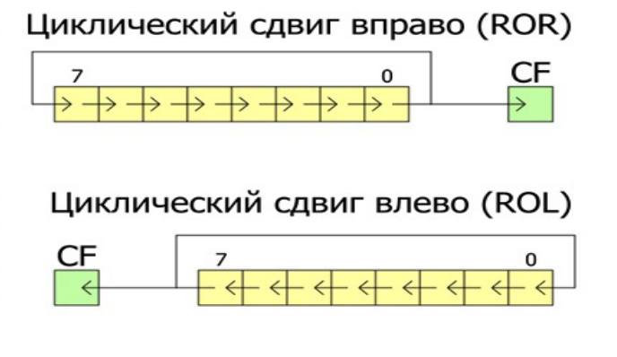
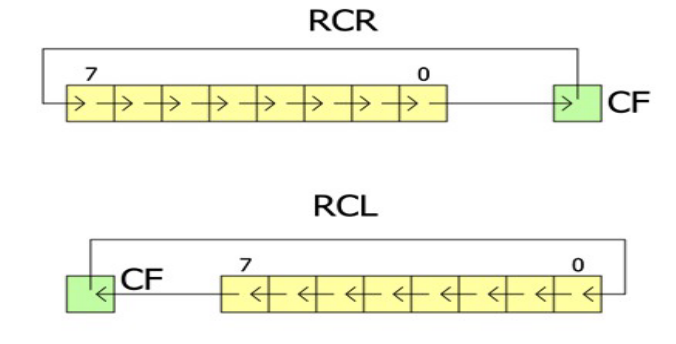
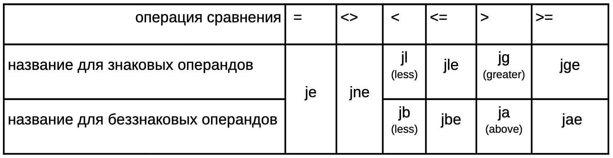
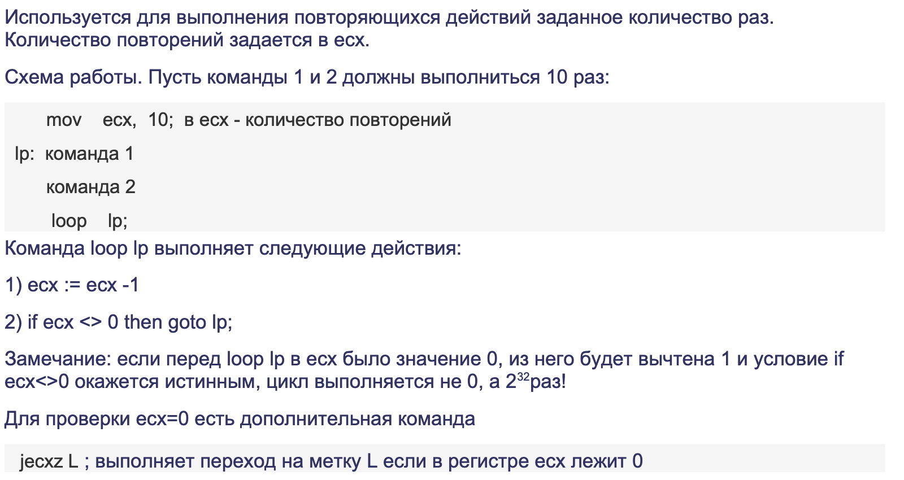

# 22.02.23 / Работа с битами и условными переходами
## Битовые инструкции

### XOR
Побитовое "Исключающее ИЛИ": `op1 = op1 ^ op2`
```nasm
XOR op1 op2
```
#### :floppy_disk: Операнды
- `op1` - r/m8, r/m16, r/m32
- `op2` - r/m8, r/m16, r/m32, i8, i16, i32

### AND
Побитовое "И": `op1 = op1 & op2`
```nasm
AND op1 op2
```
#### :floppy_disk: Операнды
- `op1` - r/m8, r/m16, r/m32
- `op2` - r/m8, r/m16, r/m32, i8, i16, i32

### OR
Побитовое "ИЛИ": `op1 = op1 | op2`
```nasm
OR op1 op2
```
#### :floppy_disk: Операнды
- `op1` - r/m8, r/m16, r/m32
- `op2` - r/m8, r/m16, r/m32, i8, i16, i32

### NOT
Инвертирует биты `op1`
```nasm
NOT op1
```
#### :floppy_disk: Операнды
- `op1` - r/m8, r/m16, r/m32

### SHL / SHR (shift left/right)
Производит сдвиг каждого бита `op1` влево/вправо на `op2` позиций

#### :floppy_disk: Операнды
- `op1` - r/m8, r/m16, r/m32
- `op2` - i8, CL (берется по модулю 32)
#### :bangbang: Важно
1) `op2` может быть либо константой, либо `CL`. Так исторически сложилось.
2) При сдвиге влево младшие биты заполняются нулями. А последний бит, который был "удален", записывается в флаг `CF`.
3) Сдвиг беззнаковых чисел происходит как в языке Си. В случае знаковых чисел рекомендуется использовать `SAL` и `SAR`.

```nasm
SHL op1, op2
SHR op1, op2
```

Пример использования:

```nasm
MOV CL, 10
SHL EAX, CL
```

### SAL / SAR (shift arithmetic left/right)
Производит сдвиг каждого бита `op1` влево/вправо на `op2` позиций.

#### :floppy_disk: Операнды
- `op1` - r/m8, r/m16, r/m32
- `op2` - i8, CL (берется по модулю 32)
#### :bangbang: Важно
1) `op2` может быть либо константой, либо `CL`. Так исторически сложилось.
2) При сдвиге влево младшие биты заполняются нулями. А последний бит, который был "удален", записывается в флаг `CF`.
3) При сдвиге вправо старший бит сохраняется. А последний бит, который был "удален", записывается в флаг `CF`.

```nasm
SAL op1, op2
SAR op1, op2
```

Пример использования:

```nasm
MOV CL, 10
SAL EAX, CL
```

### ROL / ROR / RCL / RCR  - циклические сдвиги
Производит *ЦИКЛИЧЕСКИЙ* сдвиг каждого бита `op1` влево/вправо на `op2` позиций.

- Команда `ROL` **(rotate left)** выполняет побитовый сдвиг операнда влево на `op2` позиций. Старший бит `op1` помещается на место младшего. Все биты `op1` сдвигаются влево на место старших битов. Величина сдвига определяется вторым операндом `op2`.
- Команда `ROR` **(rotate right)** выполняет побитовый сдвиг операнда вправо на `op2` позиций. Младший бит `op1` помещается на место старшего. Все биты `op1` сдвигаются вправо на место младших битов. Величина сдвига определяется вторым операндом `op2`.



- Команда `RCL` **(rotate through carry left)** выполняет побитовый сдвиг `op1` влево через флаг переноса на `op2` позиций. Старший бит `op1` помещается во флаг `CF`, все биты операнда сдвигаются влево на место старших битов и предыдущее содержимое флага `CF` помещается в младший бит `op1`. Величина сдвига определяется вторым операндом `op2`.
- Команда `RCR` **(rotate through carry right)** выполняет побитовый сдвиг `op1` вправо через флаг переноса на `op2` позиций. Младший бит `op1` помещается во флаг `CF`, все биты операнда сдвигаются вправо на место младших битов и предыдущее содержимое флага `CF` помещается в старший бит `op1`. Величина сдвига определяется вторым операндом `op2`.



#### :floppy_disk: Операнды
- `op1` - r/m8, r/m16, r/m32
- `op2` - i8, CL (берется по модулю 32)

#### :bangbang: Важно
1) `op2` может быть либо константой, либо `CL`. Так исторически сложилось.
2) Команды `ROR`/`ROL` производят обычный циклический сдвиг, а `RCR`/`RCL` - через флаг переноса `CF`.

```nasm
; ОБЫЧНЫЙ ЦИКЛИЧЕСКИЙ СДВИГ
ROL op1, op2
ROR op1, op2
; ЦИКЛИЧЕСКИЙ СДВИГ ЧЕРЕЗ CF
RCL op1, op2
RCR op1, op2
```

Пример использования:

```nasm
MOV CL, 10
ROR EAX, CL
```

## Задача № 1 (снова Ассемблер.Переводчик)
Дан код на Си:

```c
int a[4]; short b[4];
unsigned int c[4]; unsigned short d[4];
char p[4]; unsigned char q[4];
```

Переведите на язык ассемблера следующие выражения:

3) `a[0] = a[0] << a[1];`

```nasm
MOV CL, byte[a + 4]
SAL dword[a], CL
```

4) `a[0] = p[0] | (p[1] << 8) | (p[2] << 16);`

```nasm
xor EAX, EAX
xor ECX, ECX
mov AL, byte[p]
mov CL, byte[p + 1]
SHL ECX, 8
OR EAX, ECX 
mov CL, byte[p + 2]
SHL ECX, 16
OR EAX, ECX
mov dword[a], EAX
```

#### :bangbang: Внимание
- Перед запуском программы на ассемблере **(на ejudge особенно)** НЕ ГАРАНТИРУЕТСЯ, что все регистры (`EAX`, `EDX`) будут нулевыми! 
- От таких случаев необходимо *предохраняться*! Используйте в самом начале `xor EAX, EAX`!

5) `c[0] = (c[0] << q[0]) | (c[0] >> (32 - q[0]))` - крокодил(в ванной) на языке Си

```nasm
; Решение "в лоб"
xor EAX, EAX
xor ECX, ECX
mov CL, byte[q]
mov EDX, dword[c]
mov EAX, EDX
sal EDX, CL
mov CL, 32
sub CL, byte[q]
sar EAX, CL
OR EAX, EDX
mov dword[c], EAX


; Решение оптимальное
; НА САМОМ ДЕЛЕ, тут таится ЦиКлИчЕсКиЙ сДвИг! xDDDDDDD
xor EAX, EAX
xor ECX, ECX
mov CL, byte[q]
ROL dword[c], CL
```

## Условные (или нет) переходы

### JMP (jump)
```nasm
JMP label
```
Проводит безусловный переход к метке `label`

Пример:
```nasm
L:  mov EAX, L
    jmp EAX
    ; Результат? Программа зациклится
```

### Семейство инструкций JX и JNX (conditional jump)
~~Доминик Торетто одобряет~~
Переходы выполняются в зависимости от значений флагов, которые установлены перед командой перехода. Например, флаги могут быть установлены командой `cmp` или какими-то арифметическими командами.

#### Переходы, которые выполняются при значении флага
- J<первая буква названия флага> <адрес перехода> ; переход при флаге = 1
```nasm
JC fin ; jump CF, переход на метку fin, если СF=1
```
Если CF = 0, перехода нет, выполняется следующая по тексту программы команда.
- JN<первая буква названия флага> <адрес перехода> ; переход при флаге = 0
```nasm
JNC fin ; jump not CF, переход на метку fin, если СF=0
```
Если CF =1, перехода нет, выполняется следующая по тексту программы команда.

#### Переходы, в зависимости от результата сравнения (CMP и TEST)
Указанные ниже команды перехода также анализируют значения соответствующих флагов.
```nasm
cmp op1, op2    ; ограничения на операнды и значения флагов 
                ; как в команде вычитания sub op1, op2

test op1, op2   ; ограничения на операнды и значения флагов 
                ; как в команде AND op1, op2
```

#### :floppy_disk: Операнды
- `op1` - r/m8, r/m16, r/m32
- `op2` - r/m8, r/m16, r/m32, i8, i16, i32



```nasm
j<Флаг> :
JZ ; JE
JC ; JB
JP
JO

JNZ ; JNE
JNC ; JAE
JNP
JNO

Беззнаковые:
JA ; >
JB ; <
JAE ; >=
JBE ; <=
JNA ; <=
JNB ; >=
JNAE ; <
JNBE ; >

Знаковые:
JG ; >
JL ; <
JGE ; >=
JLE ; <=
```

```c
a > b; a - b > 0 => SF = 0
a < b; a - b < 0 => SF = 1 ИЛИ SF = 0 и OF = 1 
```

Пример:

```nasm
    sub EAX, EBX
    JE zero
        ; a != b
    jmp after
zero:
        ; a == b
after:
```

#### Цикл LOOP


## Задача № 2 (симулятор Дмитрия Пучкова)
Дан код на Си:

```c
int x, y, z;
if (x > y && z == 0) {
    x += y;
}
```

Переведите ЭТО на язык ассемблера.

```nasm
    mov eax, dword[x]
    cmp eax, dword[y]
    JLE NN
    mov EDX, dword[z]
    cmp EDX, 0
    JNE NN
    xor EAX, EAX
    mov EAX, dword[x]
    add eax, dword[y]
    mov dword[x], eax
NN: 
    nop ; эта инструкция ничего не делает
```

## Задача № 3 (на дом)
Дан код на Си:

```c
unsigned int a, b, c;
if (a <= b && !++c) 
    b = a * c;
else 
    c = 0;
```
Переведите ЭТО на язык ассемблера.

```nasm
; Решение
    mov EAX, dword[a]
    cmp EAX, dword[b]
    ja  else
    inc dword[c]
    cmp dword[c], 0
    jne else
    mul dword[c]
    mov dword[b], EAX
    jmp after
else:
    mov dword[c], 0
after:
```