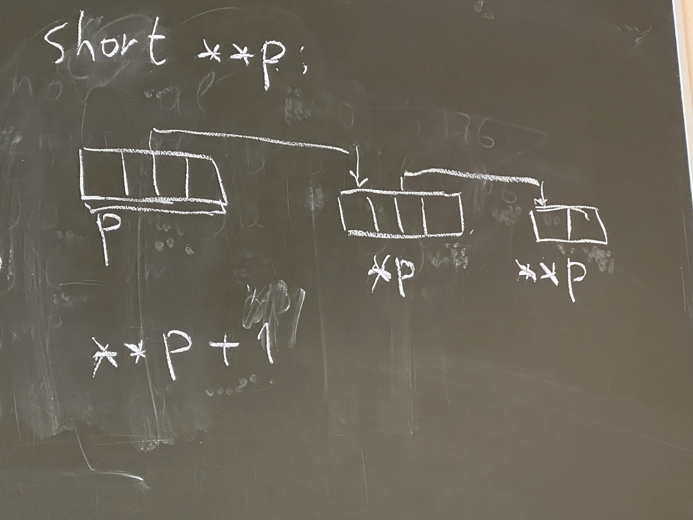

# 15.03.23 / Разбор полетов с самостоятельной работы и указатели c массивами
## Разбор полетов
### Главный затык
```nasm
section .data
    c dd 0aabbccddh
    b dw 0xea
    a db 161
    ; всего 7 байт
```
#### :bangbang: Важно
- x86 - платформа Little-endian! Младший байт записывается в оперативной памяти первым
- Как числа на самом деле представляются в оперативной памяти:

<table>
    <thead>
        <tr>
            <th>Переменная</th>
            <th colspan=4>c</th>
            <th colspan=2>b</th>
            <th>a</th>
        </tr>
    </thead>
    <tbody>
        <tr>
            <th>Значения в ячейках</th>
            <td>dd</td>
            <td>cc</td>
            <td>bb</td>
            <td>aa</td>
            <td>ea</td>
            <td>00</td>
            <td>a1</td>
        </tr>
        <tr>
            <th>Указатель на младший байт</th>
            <td>^c</td>
            <td></td>
            <td></td>
            <td></td>
            <td>^b</td>
            <td></td>
            <td>^a</td>
        </tr>
        <tr>
            <th>Адрес в памяти (байт)</th>
            <td>0</td>
            <td>1</td>
            <td>2</td>
            <td>3</td>
            <td>4</td>
            <td>5</td>
            <td>6</td>
        </tr>
    </tbody>
</table>

```nasm
mov AX, [b + 1] ; в AX запишется 0a100h
```

### Затык поменбше
```nasm
mov AL, -80 ; 176 в беззнаковом виде, -80 в знаковом виде
cmp AL, 150 ; 150 в беззнаковом виде, -106 в знаковом виде
jb .m1      ; беззнаковое сравнение! 176 < 150 - перехода не будет
jl .m2      ; знаковое сравнение! -80 < -106 - перехода не будет
jmp .m3     ; безусловный переход 
```

## Указатели
Самое главное, что нужно здесь помнить - **все адреса 32-битные**!
```c
short **p;  // p - указатель(4 байт) на указатель(4 байт) 
            // на саму переменную(2 байт)
**p         // проводя операцию двойного разыменования,
            // мы обращаемся к памяти 3 раза
```



### Пример работы
```c
short **p;
...
**p + 1
```
На ассемблере это выглядит так:
```nasm
mov EAX, dword[p]   ; p
mov EAX, dword[EAX] ; *p
mov AX, word[EAX]   ; **p  (не забываем, что у нас **p - short!)
add AX, 1           ; **p + 1
```

## Перейдем к массивам
Работа с массивами аналогична работе с указателями. Но тут есть несколько тонкостей...
### Простейший пример работы
```c
short *p;
short a[3];

p[1] = *(a + 2);
```

```nasm
mov AX, word[a + 2 * 2]
mov EBX, dword[p]           ; не забываем, что здесь p - адрес значения 
                            ; указателя, а dword[p] - само значение 
                            ; указателя
mov word[EBX + 2 * 1], AX
```

### Пример с подвохом
```c
short *px, *py;
*(px++) = *py + --(*py);
```

Кто бы мог подумать, что здесь таится UB! (проверьте!)

```nasm
mov EAX, dword[py]  ; py
mov BX, word[EAX]   ; *py
shl BX, 1
dec BX
dec word[EAX]
mov EAX, dword[px]
inc dword[px]
mov word[EAX], BX
```

## Обратные задачи (4.14)
~~Кристофер Нолан одобряет~~

Дан код на ассемблере. Нужно поработать переводчиком на Си.
### A

```nasm
mov EAX, dword[a]
cmp EAX, dword[b]
cmovb EAX, dword[b]
mov dword[x], EAX
```

Решение:
```c
unsigned int a, b, x;
x = b > a ? b : a;
```

### Б

```nasm
mov EAX, dword[a]
mov EDX, dword[a + 4]
add EAX, dword[b]
adc EDX, dword[b + 4]
sub EAX, dword[c]
sbb EDX, dword[c + 4]
mov dword[a], EAX
mov dword[a + 4], EDX
```

Решение:
```c
unsigned long long a, b, c;
a = a + b - c;
```

### В

```nasm
    mov ECX, dword[n]
    inc ECX
    lea EBX, [a + 4 * ECX - 4]
    xor EAX, EAX
L:
    imul EAX, dword[x]
    add EAX, dword[EBX]
    sub EBX, 4
    dec ECX
    jne L
    mov dword[f], EAX
```

Решение:
```c
int a[n + 1];
int n, f, x;
int cnt = n;
int *ptr = a + n;
int f = 0;
do {
    f *= x;
    f += *ptr;
    ptr--;
    cnt--;
} while (cnt != 0);
```

### Г

```nasm
    cmp dword[a], 0
    je L1
    mov EAX, dword[b]
    cdq
    idiv dword[a]
    jmp L2
L1:
    mov EAX, 0
L2:
    mov dword[x], EAX
```

Решение:
```c
int res, x, b, a;
if (a == 0) {
    res = 0;
} else {
    x = b / a;
}
```

### Д

```nasm
mov EAX, dword[a]
imul dword[b]
idiv dword[c]
mov dword[x], EAX
```

Решение:
```c
int a, b, c, x;
x = a * b / c;
```

### Е

```nasm
L:
    xchg EAX, dword[s]
    cmp EAX, 1
    je L
```

Решение:
```c
int s;
while (s == 1)
    ; //  Нафига, а главное - зачем?
```

### Ж

```nasm
    mov EBX, dword[b]
    test EBX, EBX
    je L
    cmp dword[EBX], 0
    jne L
    mov dword[EBX], 1
L: 
```

Решение:
```c
int *b;
if (b != 0) {
    if (*b == 0) {
        *b = 1;
    }
}
```

### З

```nasm
    movsx EAX, word[a]
    movsx EBX, word[b]
    movsx ECX, word[c]
    cmp EAX, EBX
    jl L1
    cmp EAX, ECX
    jge L2
L1:
    add word[a], 10h
    jmp L3
L2:
    sub word[a], 10h
L3:
```

Решение:
```c
short a, b, c;
if (a < b) {
    a += 0x10;
} else if (a >= c) {
    a -= 0x10;
}
```