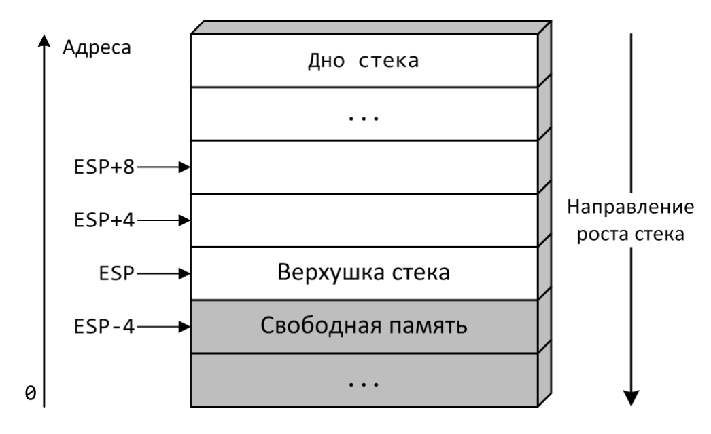

# 22.03.23 / Стек и организация работы функций (cdecl)
## Стек
Специальная область памяти для, к примеру, организации работы функций (о чем и пойдет речь дальше). Как переживший зимнюю сессию читатель уже знает, данная структура данных работает по принципу LIFO (Last In - First Out).

#### :bangbang: Важно
- Всегда работайте с двойными словами (dword).

### PUSH
Ставит на верхушку стека значение `op1`. 
```nasm
push r32/m32/i32

АНАЛОГИЧНО

sub ESP, 4
mov dword[ESP], op1
```
### POP
Снимет с верхушки стека значение и запишет его в `op1`.
```nasm
pop r32/m32

АНАЛОГИЧНО

mov op1, dword[ESP]
add ESP, 4
```
### Роль ESP в управлении стеком
Для организации работы стека используется регистр `ESP`. Стек растет вниз: при помещении новых данных на стек адрес верхушки уменьшается, при снятии данных – увеличивается. При выполнении 32-разрядного кода естественной единицей данных на стеке является двойное слово. Принято изображать стек в виде «стопки» двойных слов.



- `ESP` указывает на последнее занятое слово.
- `ESP + 4` указывает на предпоследнее занятое слово.
- `ESP - 4` указывает на первое свободное слово.
- `ESP - 8` указывает на второе свободное слово.

И так далее.

## Задачка от одного известного кинорежиссера
Принять на вход последовательность целых чисел, которая заканчивается нулем, и вывести их на экран в обратном порядке.

Очевидно, что эта задача идеальна для использования стека (проверьте!).

```nasm
section .text
global main
main:
    xor EBX, EBX
.loop_input:
    call io_get_dec
    cmp EAX, 0
    jne .loop_output
    push EAX
    inc EBX
    jmp .loop_input

.loop_output:
    cmp EBX, 0
    jne .end_output
    pop EAX
    call io_print_dec
    mov EAX, ' '
    call io_print_char
    dec EBX
    jmp .loop_output
.end_output:
    call io_newline
    xor EAX, EAX
    ret
```

## Организация вызовов функций (cdecl)
Любое соглашение вызова функции должно определить, как будут использоваться различными функциями регистры, способ передачи аргументов вызова и возвращаемого значения и т. д. Основным соглашением вызова на платформе IA-32/Linux является cdecl со следующими правилами.
- Для вызова функции используется команда `CALL fname`, где операнд `fname` – метка начала вызываемой функции. Для возврата в точку вызова – команда `RET`.
- Для передачи аргументов вызова используется стек. Аргументы расположены в «обратном» порядке: в момент вызова на верхушке стека находится первый аргумент, следом за ним – второй и т. д. 
- Для хранения аргументов используются двойные слова. Например, для параметров типа `char`, `short`, `int`, `long` будет использовано 4 байта. Для типа `long long` – 8 байтов.
- Возвращаемое значение передается в вызвавшую функцию через регистр `EAX`.

- Автоматические локальные переменные размещаются на стеке, внутри *фрейма* вызова функции. Если регистр `ESP` указывает на верхушку стека, что позволяет определить нижнюю границу фрейма, то регистр `EBP` используется для определения верхней границы фрейма.
- Регистры `EAX`, `ECX`, `EDX` при необходимости должны сохраняться перед вызовом в вызывающей функции. Регистры `EBX`, `ESI`, `EDI` при необходимости должны сохраняться вызванной функцией. Для хранения используется память во фрейме вызова функции (далее слово «вызов» будет опускаться для краткости изложения). 
- Регистры `ESP` и `EBP` используются для организации работы со стеком.

Код функции можно разделить на три части: пролог, тело функции и эпилог. В прологе и эпилоге происходит создание нового фрейма, сохранение прежнего значения `EBP`, в эпилоге освобождение фрейма и восстановление `EBP`. На рисунке приведено распределение памяти во фрейме, границы фрейма выделены жирными линиями.


Фрейм начинается с адреса возврата, помещенного на стек командой `call`. Сразу за ним расположен сохраненный регистр `EBP`, на это место памяти указывает новое значение, помещенное в `EBP` во время выполнения пролога. Далее в памяти расположены (если есть такая необходимость) сохраняемые в вызванной функции регистры и автоматические локальные переменные. Нижняя часть фрейма отводится для аргументов вызова функций (если из данной функции что-либо вызывается).

### CALL
~~Жаль, что нет команды NIGHTCALL~~

Инструкция `call` заносит на стек адрес следующей команды (чтобы можно было понять, куда возвращаться после выполнения функции) и передает управление по адресу, указанному в операнде.

#### :floppy_disk: Операнды
- `op1` - r32/m32/i32

```nasm
call op1
```

### RET (return)
Инструкция `ret`, наоборот, берет со стека значение и записывает в `EIP` (возвращаемся из функции).

#### :floppy_disk: Операнды
- `op1` - i16

Команда `ret` читает из стека адрес возврата и заносит его в регистр `EIP`, передавая таким образом управление. Необязательный числовой параметр команды `ret` определяет число байтов, на которые должен быть увеличен регистр стека после извлечения из него адреса возврата (это пока что вряд ли нам пригодится, конечно).
Если команда используется в 32-разрядном режиме адресации, то из стека читается 32-битный адрес и заносится в регистр `EIP`. Кроме того в 32-разрядном режиме числовой параметр определяет количество не байт, а **слов**, извлекаемых из стека.

```nasm
ret op1
```

## Задачи, где нужно что-то искать
### В поисках скалярного произведения
Реализовать функцию, вычисляющую скалярное произведение двух массивов  `int`.

```c
int conv(int *a, int *b, int len);
```


Над адресом возврата последовательно расположены три параметра. Их значения извлекаются из памяти через задание нужного смещения от регистра EBP. Под сохраненным указателем фрейма EBP расположены ячейки, в которых были сохранены, а затем восстановлены значения регистров `ESI` и `EDI`. Указатель стека `ESP` показан на момент, когда расширенный сохранением регистров пролог закончился, и началось выполнение тела функции.

```nasm
conv:
    push EBP
    mov EBP, ESP            ; Стандартный пролог
    push ESI                ; Сохраняем ESI
    push EDI                ; Сохраняем EDI
    mov EDI, dword [EBP+8]  ; Извлекаем со стека первый параметр a
    mov ESI, dword [EBP+12] ; Извлекаем со стека второй параметр b
    mov ECX, dword [EBP+16] ; Извлекаем со стека третий параметр len
    mov EAX, 0              ; В EAX будем накапливать скалярное произведение

.l:
    mov EDX, dword[EDI + 4 * ECX - 4]
    imul EDX, dword[ESI + 4 * ECX - 4]
    add EAX, EDX
    loop .l
    ; Для организации цикла была использована команда LOOP, 
    ; диапазон изменения регистра ECX – от len до 1. 
    ; Поэтому к базовому адресу массива прибавляется смещение 
    ; вида 4 * ECX - 4, что обеспечивает обращение 
    ; к индексам (len - 1)...0

    pop EDI                 ; Восстанавливаем сохраненный регистр EDI
    pop ESI                 ; Восстанавливаем сохраненный регистр ESI
    mov ESP, EBP            ; Стандартный эпилог
    pop EBP
    ret
```
### В поисках максимума
Реализовать функцию, ищущую максимум в массиве `int`.

```c
int max(int *a, int n);
```

```nasm
max:
    push EBP
    mov EBP, ESP                ; Стандартный пролог
    mov EAX, 0x80000000
    mov ECX, dword[EBP + 12]    ;  n
    test ECX, ECX
    jz .L2
    mov EDX, dword[EBP + 8]     ; *a
    push EBX                    ; Сохраняем EBX


.L1:
    mov EBX, dword[EDX]
    cmp EBX, EAX
    cmovg EAX, EBX
    add EDX, 4
    loop .L1

    pop EBX
.L2:    
    leave
    ret
```

### В поисках среднего

Реализовать функцию, вычисляющую среднее арифметическое трех чисел `int`.

```c
int mean(int a, int b, int c);
```

```nasm
mean:
    push EBP
    mov EBP, ESP                ; Стандартный пролог
    mov EAX, dword[EBP + 8]    
    add EAX, dword[EBP + 12]     
    add EAX, dword[EBP + 16]
    mov ECX, 3

    mov EDX, EAX                ; Эти две команды делают то же самое,
    sar EDX, 31                 ; что и CDQ
                                ; Но CDQ медленее (понимать надо!).

    idiv ECX
    mov ESP, EBp
    pop EBP
    ret
```

### В поисках большего

Написать strcmp на ассемблере (строки обязательно закончатся нулем).

```nasm
strcmp:
    push EBP
    mov EBP, ESP                ; Стандартный пролог
    mov EAX, dword[EBP + 8]     ; *s1
    mov ECX, dword[EBP + 12]    ; *s2

.L
    mov DL, byte[EAX]
    cmp DL, byte[ECX]           ; s1[i] ? s2[i]
    jb .end1                    ; s1[i] < s2[i]
    ja .end2                    ; s2[i] > s2[i]
    cmp DL, 0                   
    jz .lev                     ; s1[i] = s2[i] = 0
    inc EAX
    inc ECX
    jmp .L

.end1:
    mov EAX, -1
    leave
    ret

.end2:
    mov EAX, 1
    leave
    ret

.lev:
    mov EAX, 0
    leave
    ret
```
