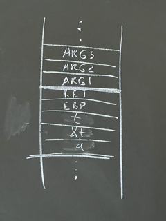

# 29.03.23 / Продолжение изучения мира функций + выравнивание структур
## Очередная задача на перевод 
Дана функция на языке Си:
```c
int foo(int a) {
    int t;
    if (bar(a, &t)) { // bar делает что-то...
        return t;
    }
    return 0;
}
```

Переведите ЭТО на язык Ассемблера.



```nasm
foo:
    push EBP
    mov EBP, ESP
    lea EAX, EBP - 4
    mov dword[EBP - 8], EAX
    mov EAX, dword[EBP + 8]
    mov dword[EBP - 12], EAX
    sub ESP, 12
    call bar
    cmp EAX, 0
    je .z
    mov EAX, dword[EBP - 4]
    jmp .end
.z:
    xor EAX, EAX
.end:
    add ESP, 12
    pop EBP
    ret
```

## Обратная задача на перевод 
Дана функция на языке Ассемблера:
```nasm
foo:
    push EBP
    mov EBP, ESP
    push dword[EBP + 12]
    push dword[EBP + 8]
    call [EBP + 16]
    leave
    ret
```

Переведите ЭТО на язык Си.

```c
void* foo(void* a, void* b, void*(f)(void*, void*)) {
    return f(a, b);
}
// Такая конструкция полезна в использовании с абстрактными классами
// (Но до C++ нам надо еще дожить)
```

## Рекурсивная задачка (комбинаторика inside)

Написать рекурсивную функцию вычисления числа сочетаний: 

$C_n^{k}=C_{n-1}^{k} + C_{n-1}^{k-1}$

$C_0^0=C_n^n = 1$

```nasm
comb:
    push EBP
    mov EBP, ESP
    mov EAX, dword[EBP + 8]     ; k
    mov ECX, dword[EBP + 12]    ; n

    cmp EAX, 0
    je .one
    cmp EAX, ECX
    je .one
    cmp ECX, 0
    je .zero

    dec ECX
    push ECX
    push EAX
    call comb                   ; C_(n-1)_k
    mov EDX, EAX
    pop EAX
    pop ECX

    dec EAX
    push EDX
    push ECX
    push EAX
    call comb                   ; C_(n-1)_)(k-1)
    add dword[EBP + 16], EAX
    pop EAX
    pop ECX
    pop EDX
    mov EAX, EDX
    jmp .end
.one:
    mov EAX, 1
    jmp .end
.zero:
    mov EAX, 0
.end:
    pop EBP
    ret
```

## Факториал на ассемблере
Нетрадиционный алгоритм вычисления факториала на языке Си:

```c
int g(int n) {
    return f(n, 1)
}

int f(int n, int res) {
    return n ? f(n - 1, res * n) : res;
}
```

Переведем это на язык Ассемблера:

```nasm
f:
    push EBP
    mov EBP, ESP
    mov EAX, dword[EBP + 12]    ; res
    mov ECX, dword[EBP + 8]     ; n
    cmp ECX, 0
    jz .end
    imul ECX
    push EAX
    dec ECX
    push ECX
    call f
    add ESP, 8                  ; освобождаем стек
.end: 
    pop EBP
    ret

g:
    ; Реализация функции g дается читателю в качестве упражнения
```

### Внезапная задача
Реализуйте функцию g на ассемблере. Докажите, что данный алгоритм вычисления факториала работает корректно.

## Структуры на языке Ассемблера
Требования к выравниванию типов

<table>
    <thead>
        <tr>
            <th>Архитектура</th>
            <th colspan=2>IA-32</th>
        </tr>
    </thead>
    <tbody>
        <tr>
            <th>Тип \ ОС</th>
            <td>Linux</td>
            <td>Windows</td>
        </tr>
        <tr>
            <th>сhar</th>
            <td>-</td>
            <td>-</td>
        </tr>
        <tr>
            <th>short</th>
            <td>2</td>
            <td>2</td>
        </tr>
        <tr>
            <th>int</th>
            <td>4</td>
            <td>4</td>
        </tr>
        <tr>
            <th>long</th>
            <td>4</td>
            <td>4</td>
        </tr>
        <tr>
            <th>ptr</th>
            <td>4</td>
            <td>4</td>
        </tr>
        <tr>
            <th>float</th>
            <td>4</td>
            <td>4</td>
        </tr>
        <tr>
            <th>double</th>
            <td>4</td>
            <td>8</td>
        </tr>
        <tr>
            <th>long double</th>
            <td>4</td>
            <td>4</td>
        </tr>
        <tr>
            <th>Структура</th>
            <td colspan=2>MAX выравнивание полей</td>
        </tr>
        <tr>
            <th>Объединение</th>
            <td colspan=2>MAX выравнивание полей</td>
        </tr>
        <tr>
            <th>Массив</th>
            <td colspan=2>Выравнивание элемента массива</td>
        </tr>
    </tbody>
</table>

#### :bangbang: Важно
- Если требования к выравниванию - `k`, то общий размер структуры кратен `k`!