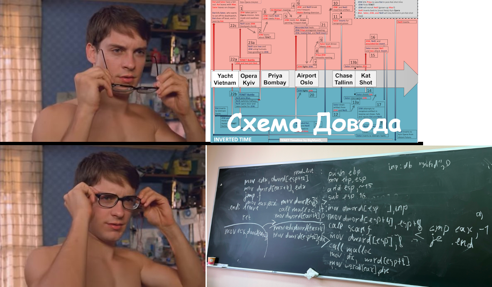

# 05.04.23 / Вызов стандартных функций + Списки
## Использование библиотечных функций
Прогеры написали много полезных функций, которые очень бы хотелось использовать в своей программе. 
Чтобы использовать все это счастье, необходимо:
1. Объявить внешнюю (не определенную в данном файле) метку кода, на которую будет передавать управление команда `CALL`.
```nasm
; ДЛЯ Linux
extern printf

; ДЛЯ Windows И macOS
extern _printf
```
Объявление внешних библиотечных функций в ассемблерном коде требует знания правил перевода имен функций из языка высокого уровня в имена меток. К счастью, для языка Си и платформы `Linux/IA-32` это правило тривиально – имя функции никак не меняется, достаточно задать директиву `extern fname`, где `fname` – имя нужной функции. Для 32-битных версий `Darwin` (`Mac OS X`) и `Windows` правило перевода отличается: Си-функции fname будет соответствовать метка с именем `_fname`.

2. Включение библиотечных функций в исполняемый код. Скрипт сборки учебных программ `build_asm.sh` включает в исполняемую программу стандартную библиотеку языка Си, что позволяет свободно вызывать любые функции этой библиотеки (при соблюдении перечисленных правил). Вопрос включения кода произвольных библиотек в собираемую программу в данном разделе не рассматривается.

К примеру, при запуске компоновщика нужно указать ключ:
```
Подключаем math.h
-lm 
```

3. Провести выравнивание границ фрейма по кратным 16 адресам, статически распределяя в нем память под переменные, сохраняемые значения и аргументы вызова.

Последним (с наибольшим адресом) двойным словом во фрейме является адрес возврата. Помимо того, стандартный пролог сохраняет регистр `EBP`. Таким образом, размер дополнительно выделяемой под фрейм памяти берется как минимальное допустимое число из ряда 8, 24, 40, ...

```nasm
and ESP, ~15 ; Трюк для выравнивания стека
sub ESP, 16

mov dword[ESP], hello ; Помещаем адрес строки как аргумент
call printf
```

### Простейший(нет) пример использования
Реализовать функцию, вызывающую стандартную функцию `qsort`.
```c
void qsort(void *a, size_t n, size_t sz_arg, int(*f)(void*, void*))

void sort(void *, size_t)
```

```nasm
f:
    push EBP
    mov EBP, ESP
    mov EAX, dword[EBP + 8]
    mov EAX, dword[EAX]
    mov EDX, dword[EBP + 12]
    cmp EAX, dword[EDX]
    jl .LL
    je .LE
    mov EAX, 1
    jmp .end
.LL:
    mov EAX, -1
    jmp .end
.LE:
    mov EAX, 0
.end:
    mov ESP, EBP
    pop EBP
    ret

sort:
    push EBP
    mov EBP, ESP
    and ESP, ~15
    sub ESP, 16
    mov EAX, dword[EBP + 8]
    mov dword[ESP], EAX
    mov EAX, dword[EBP + 12]
    mov dword[ESP + 4], EAX
    mov dword[ESP + 8], 4
    mov dword[ESP + 12], f
    call qsort
    leave 
    ret
```

## Списки на Ассемблере


Рассмотрим следующий список, реализованный на языке Си:
```c
typedef struct list_t {
    short key;
    struct list_t *next;
} list;
```

### Чтение списка из стандартного ввода
Прочитать список из стандартного потока ввода и вернуть указатель на первый элемент. Последовательность чисел оканчивается -1.
```c
list *read_list(void)
```

```nasm
section .data
    inp: db "%hd", 0


section .text
read_list:
    push EBP
    mov EBP, ESP
    and ESP, ~15
    sub ESP, 16
    mov dword[ESP], 8
    call malloc
    mov dword[EAX + 4], 0
    mov ECX, dword[EAX + 4]
.f:
    mov dword[ESP], inp
    mov dword[ESP + 4], ESP + 8
    call scanf
    cmp EAX, -1
    je .end
    mov dword[ESP], 8
    mov EDX, dword[EAX + 4]
    mov dword[ESP + 12], EDX
    call malloc
    mov DX, word[ESP + 8]
    mov word[EAX], DX
    mov EDX, dword[ESP + 12]
    mov dword[EAX + 4], EDX ;?
    jmp .f
.end:
    mov EAX, ECX
    leave
    ret
```



Ирония в том, что мы не проверяли работоспособность программы выше, поэтому если что-то пойдет не так, то так и задумывалось изначально)

Исправление багов дается читателю в качестве простого упражнения.

Задача на дом: реализуйте сортировку списка.
