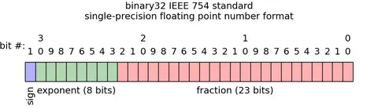

# 19.04.23 / Работа с числами с плавающей точкой (x87)
## Экспоненциальная форма
Любое вещественное число $a$ можно записать в экспоненциальной форме:

$a = (-1)^{s}*p^{e}*m$, где
- $s$ - знак числа (0 - "+", 1 - "-")
- $q$ - основание системы счисления
- $m$ - мантисса
- $e$ - порядок числа

Таким образом, $15800000 = 1,58 * 10^{7} = 15,8 * 10^{6} = 158 * 10^{5} = 1,58E+7$.
## Стандарт IEEE 754
Для работы с вещественными числами используется представление с плавающей точкой. Число представляется в виде произведения трех множителей: $(-1)^{s}*2^{e}*m$.

Степень $s$ определяет, является число положительным или отрицательным. Мантисса $m$ – дробное двоичное число в заданном полуинтервале. В стандарте IEEE 754, задающего правила работы с числами с плавающей точкой, используются полуинтервалы: $[1.0, 2.0)$ для **нормализованных** чисел и $[0.0, 1.0)$ для **денормализованных**. Порядок $e$ определяет степень 2 во втором множителе.



Для подавления ошибок округления стандарт IEEE 754 предлагает округление к ближайшему четному числу. В случае если из двоичной дроби отбрасывается одна единица, то округляют к тому числу, у которого наименьшая значащая цифра четная, т. е. 0.

### Нормализованные числа

Каждое вещественное число (не слишком малое) $a$ представляется в следующем виде:

$a = (-1)^{s}*2^{e-off}*(1 + m * 2^{-M})$,

где $off = 2^{E-1}-1$

### Денормализованные числа
Если число слишком мало (по модулю), оно представляется в денормализованном виде.

$a = (-1)^{s}*2^{1-off}*m * 2^{-M}$,

где $off = 2^{E-1}-1$


### Специальные числа

- $e = 111...11, m = 0, s=0 \implies +\infty$
- $e = 111...11, m = 0, s=1 \implies -\infty$
- $e = 111...11, m \neq 0 \implies NaN$

## Типы чисел

<table>
    <thead>
        <tr>
            <th>Точность</th>
            <th>Тип в Си</th>
            <th>S</th>
            <th>E</th>
            <th>M</th>
            <th>$\sum$</th>
            <th>Тип в ассемблере</th>
        </tr>
    </thead>
    <tbody>
        <tr>
            <th>Одинарная</th>
            <td>float</td>
            <td>1</td>
            <td>8</td>
            <td>23</td>
            <td>32</td>
            <td>d</td>
        </tr>
        <tr>
            <th>Двойная</th>
            <td>double</td>
            <td>1</td>
            <td>11</td>
            <td>52</td>
            <td>64</td>
            <td>q</td>
        </tr>
        <tr>
            <th>Расширенная</th>
            <td>-</td>
            <td>1</td>
            <td>15</td>
            <td>64</td>
            <td>80</td>
            <td>t</td>
        </tr>
    </tbody>
</table>


## Пример
Пусть $E = 3, M = 4, S = 1$, тогда $off = 2^{3-1} - 1 = 3$.

<table>
    <thead>
        <tr>
            <th>n</th>
            <th>n (Двоичная СС)</th>
            <th>s</th>
            <th>e</th>
            <th>m</th>
        </tr>
    </thead>
    <tbody>
        <tr>
            <th>+0</th>
            <td>0</td>
            <td>0</td>
            <td>000</td>
            <td>0000</td>
        </tr>
        <tr>
            <th>1 1/4</th>
            <td>1.01</td>
            <td>0</td>
            <td>011</td>
            <td>0100</td>
        </tr>
        <tr>
            <th>-3/8</th>
            <td>-0.011</td>
            <td>1</td>
            <td>001</td>
            <td>1000</td>
        </tr>
        <tr>
            <th>-inf</th>
            <td>-</td>
            <td>1</td>
            <td>111</td>
            <td>0000</td>
        </tr>
        <tr>
            <th>min norm x > 0</th>
            <td>-</td>
            <td>0</td>
            <td>001</td>
            <td>0000</td>
        </tr>
        <tr>
            <th>min x > 0 </th>
            <td>-</td>
            <td>0</td>
            <td>000</td>
            <td>0001</td>
        </tr>
        <tr>
            <th>min norm x</th>
            <td>-</td>
            <td>1</td>
            <td>110</td>
            <td>1111</td>
        </tr>
        <tr>
            <th>min denorm x</th>
            <td>-</td>
            <td>0</td>
            <td>000</td>
            <td>1111</td>
        </tr>
        <tr>
            <th>min denorm x > 0</th>
            <td>-</td>
            <td>0</td>
            <td>000</td>
            <td>0001</td>
        </tr>
    </tbody>
</table>

[Сайт, где можно потренироваться](https://www.h-schmidt.net/FloatConverter/IEEE754.html)

## Сопроцессор x87
Сопроцессор x87 содержит 8 регистров (80-битные) для размещения чисел с плавающей точкой. Регистры называются R0, R1, ... R7, но доступ к ним напрямую невозможен. Каждый регистр может занимать любое положение в стеке. Название стековых (относительных) регистров - st(0), st(1), st(2), st(3), st(4), st(5), st(6), st(7). Кроме того, имеется еще регистр состояния, по флагам которого можно, в частности, судить о результате выполненной операции. Регистр управления содержит в себе биты, влияющие на выполнение команд сопроцессора. Помимо этих регистров есть еще три служебных регистра: управляющий регистр, регистр состояния и регистр признаков. 

Регистры для данных организованы в виде аппаратно поддерживаемого стека. Регистр признаков содержит биты, описывающие состояние регистров данных: заняты они или свободны. Изначально все восемь регистров считаются свободными. Именование регистров меняется после того, как на верхушку стека было помещено новое значение (команда `FLD`) или, наоборот, значение было извлечено (команда `FSTP`). Обмен данными возможен только с памятью: на стек регистров x87 невозможно поместить непосредственно закодированную в команде величину-константу или переслать данные из регистров x86. Верхушка стека регистров именуется как `ST0`, следующий за ним регистр – `ST1` и так далее, до последнего занятого регистра. После помещения на стек нового значения оно оказывается в ранее свободном регистре `ST0`, прежний регистр `ST0` начинает называться `ST1` и т. д.

### FINIT (Float INITialize)
Проводит инициализацию сопроцессора.
```nasm
FINIT
```

### FLD/FILD (Float LoaD / Float Int LoaD)
Загружает в стек `op1`.
```nasm
FLD op1 ; для вещественных
FILD op1 ; для целых
```

#### :floppy_disk: Операнды
- Для вещественных - `op1` - m32/64/80 ИЛИ `STi` 
- Для целых - `op1` - m8/16/32/64

Псевдокод: `push(op1)`

### FLD1/FLDZ/FLDPI (Fload LoaD 1/Zero/PI)
Загружает в стек 1 / +0 / $\pi$.
```nasm
FLD1    ; 1
FLDZ    ; +0
FLDPI   ; pi
```
Псевдокод: `push(1 / +0 / pi)`

### FST/FIST
Загружает верхнее значение стека в `op1`.
```nasm
FST op1 ; для вещественных
FIST op1 ; для целых
```

#### :floppy_disk: Операнды
- Для вещественных - `op1` - m32/64/80 ИЛИ `STi` 
- Для целых - `op1` - m8/16/32/64

Псевдокод: `op1 = ST0`

### FSTP/FISTP
Выгружает из стека верхнее значение и загружает его в `op1`.
```nasm
FSTP op1 ; для вещественных
FISTP op1 ; для целых
```

#### :floppy_disk: Операнды
- Для вещественных - `op1` - m32/64/80 ИЛИ `STi` 
- Для целых - `op1` - m8/16/32/64

Псевдокод: `op1 = ST0; pop()`

## Арифметические операции
:bangbang: Примечание: в этом разделе вместо `oper` имеются в виду операции:
- `ADD` - "+"
- `SUB` - "-"
- `MUL` - "*"
- `DIV` - "/"

### Foper
```nasm
FADD `op1[, op2]`
```
<table>
    <thead>
        <tr>
            <th>op1[, op2]</th>
            <th>Что выполняется</th>
        </tr>
    </thead>
    <tbody>
        <tr>
            <th>m32/64</th>
            <td>ST0 oper= mem</td>
        </tr>
        <tr>
            <th>ST0, STi</th>
            <td>ST0 oper= STi</td>
        </tr>
        <tr>
            <th>STi, ST0</th>
            <td>STi oper= ST0</td>
        </tr>
    </tbody>
</table>

### FoperP (Pop)
```nasm
FSUBP `op1[, op2]`
```
<table>
    <thead>
        <tr>
            <th>op1[, op2]</th>
            <th>Что выполняется</th>
        </tr>
    </thead>
    <tbody>
        <tr>
            <th>STi, ST0</th>
            <td>STi oper= ST0; pop()</td>
        </tr>
        <tr>
            <th>-</th>
            <td>ST1 oper= ST0; pop()</td>
        </tr>
    </tbody>
</table>

### FIoper (Integer)
```nasm
FSUBP `op1`
```
<table>
    <thead>
        <tr>
            <th>op1</th>
            <th>Что выполняется</th>
        </tr>
    </thead>
    <tbody>
        <tr>
            <th>m16/32</th>
            <td>ST0 oper= int_to_float(op1)</td>
        </tr>
    </tbody>
</table>

## Задача 1
Решить уравнение $ax=b$.

```nasm
FINIT
FILD dword[b]
FILD dword[a]
FDIV
FST tword[x] ; 10-байтный тип
```
## Обратная польская запись
Обратная польская нотация — это форма записи математических выражений, в которой операторы расположены после своих операндов.

Например, следующее выражение:
$a + b * c * d + (e - f) * (g * h + i)$

в обратной польской нотации записывается следующим образом:
```
a b c * d * + e f - g h * i + * +
```

### Пример из задачи снизу:
$S=\sqrt{p(p-a)(p-b)(p-c)}, p = \frac{a+b+c}{2}$

$p$ = `a b c + + 2 /`

$S$ = `p p a - p b - p c - * * * sqrt`
## Задача 2
```c
double square3(double a, double b, double c)
```
Эта функция считает площадь треугольника по формуле Герона: 

$S=\sqrt{p(p-a)(p-b)(p-c)}, p = \frac{a+b+c}{2}$

Реализуйте **ЕЁ** на ассемблере.

```nasm
square3:
    push EBP
    mov EBP, ESP
    sub ESP, 8
    FINIT
    FLD dword[EBP + 8]
    FLD dword[EBP + 16]
    FLD dword[EBP + 24]
    FADDP
    FADDP
    mov dword[ESP], 2
    FILD dword[ESP]
    FDIVP
    FLD ST0
    FLD qword[EBP + 8]
    FSUBP
    FLD ST1
    FLD qword[EBP + 16]
    FSUBP
    FLD ST2
    FLD qword[EBP + 24]
    FSUBP
    FMULP
    FMULP
    FMULP
    FSQRT
    leave
    ret
```

#### :bangbang: Важно
- По соглашению `cdecl` вещественные числа должны быть возвращены через `ST0`. 