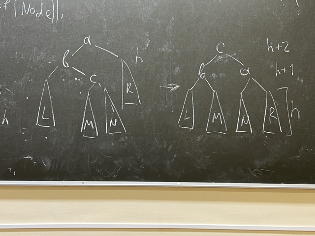
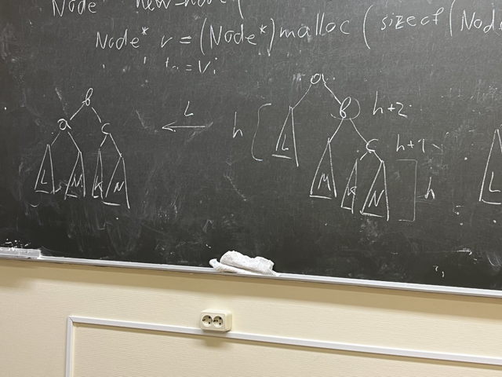

# Мудрый дуб, или беседа о деревьях
## Немножко теории
Дерево - структура данных, у которого есть узлы. У каждого узла есть потомки(тоже узлы)

Данная структура данных позволяет эффективнее проводить поиск по данным.

Узлы, у которых нет потомков - **листья**
Узел, у которого нет родителя - **корень**

**Высота дерева** - максимальная длина пути от корня до какой-то листовой вершины.

Обход проводится посредством рекурсии. 

Обычно используются **двоичные деревья.**

## Реализация

```c
struct node {
    int data;
    struct node *left, *right;
    struct node *parent; //иногда встраивают указатель на "родителя" узла
}
```

## Обход дерева
Вывести все вершины дерева в порядке ЛКП(Слева-Корень-Справа)
```c
void print_tree(struct node *tree) {
    if (tree != NULL) {
        print_tree(tree->left);
        printf("%d ", tree->right);
        print_tree(tree->right);
    }
}
```
Данный обход называется **обходом в глубину**.

### Мудрая задача
Найти вершину со значением ключа `key`. Вернуть указатель на вершину.
```c
struct node* find_node(struct node *root, int key) {
    if (!root) return NULL;
    if (root->data == key) {
        return root;
    }
    else {
        struct node *a = find_node(root->left, key);
        if (a != NULL) return a;
        return find_node(root->right, key);
    }
}
```

## Деревья поиска
В этих деревьях известно, что значения всех вершин слева меньше значения вершины-родителя, а справа - наоборот.
Напишем аналогичную функцию:
```c
typedef struct node Node;

Node* better_find_node(Node *root, int key) {
    if (!root) return NULL;
    if (root->data == key) return root;
    if (root->data > key) return better_find_node(root->left, key);
    return better_find_node(root->right, key);
}
```

Недостаток заключается в том, что с ~~НЕБАЗИРОВАННЫМИ~~ *НЕСБАЛАНСИРОВАННЫМИ* деревьями алгоритм будет неэффективен:
```
  2           1
 / \           \
1   3           2
                 \
                  3
```
Слева ~~базированное~~ сбалансированное дерево, справа - ~~кринжовое~~ НЕсбалансированное. Очевидно, что с левым деревом алгоритм поиска будет работать эффективнее *(проверьте!)*.

### Задача мудрее
Найти минимальный элемент дерева.
```c
Node *find_min(Node *root) {
    if (!root) return NULL;
    if (root->left == NULL) return root; // Тупо идем в левый тупик
    return find_min(root->left);
}
```

## Добавление вершины
Продемонстрируем Вам, дорогие читатели, алгоритм добавления вершины в дерево поиска размером в 41 строку. "Разобраться с ним" дается в качестве упражнения для читателя.
```c
Node* new_node(int v) {
    Node *r = (Node *)malloc(sizoef(Node));
    r->data = v;
    r->left = r->right = NULL;
    return r;
}

void insert_node(Node **n, int v) {
    if (!n) {
        *n = new_node(v);
        return;
    }
    Node *n1 = *n;
    while (1) {
        if (n1->data == v) return;
        if (n1->data < v) {
            if (n1->right) n1 = n1->right;
            else {
                n1->right = new_node(v);
                return;
            }
        }
        if (n1->data > v) {
            if (n1->left) n1 = n1->left;
            else {
                n1->left = new_node(v);
                return;
            }
        }
    }
}
```

Как говорилось ранее, деревья поиска хороши тогда, когда они сбалансированные. И если вам нужно добавить вершину в сбалансированное дерево, то алгоритм добавления вершины неприятно вырастет за счет поворотов(what?).

## АВЛ-деревья
Их разработали наши земляки (*хороший повод для гордости, не так ли?*).
АВЛ-дерево обладает следующим свойством: высота его левого поддерева отличается от высоты правого не больше чем на 1.
Если при добавлении вершины дерево *ДИЗБАЛАНСИРОВАЛОСЬ*, то применяют технику поворотов(what?).

### Правый поворот:


### Левый поворот:


Можете загуглить(или *заяндексить*) визуализацию процесса балансировки деревьев.